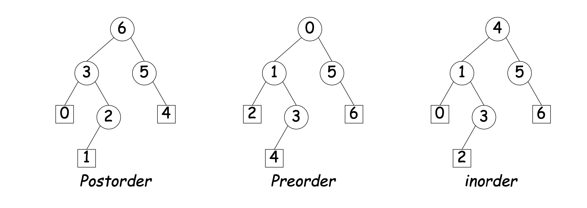

# Midterm 2 Study Notes


## Asymptotic analysis and complexity

Complexity is a difficult thing to analyze becuase there are so many factors that go into it. When we analyze complexity and cost, there are a couple things we must consider:

- How much cost does it take for the program to run? (space requirements)
- How much engineering time must be spent to write the program? (development costs)
- How much will it cost to make an upgrade? (maintenance costs)
- How robust is our program (failure costs)

The speed of a given program is also something that should be taken into account, via the following two factors:

- How much space does the program take (memory allocation)
- How much time does it take for the program to run (time allocation) 

Both these factors are important, but they must be evaluated **in the context of the input data**

One example of this is as follows: say you wanted to scan a text corpus (about $10^9$ bytes in size), the following are two possible routes:

- (Knuth) Hash trie implementation, randomized placement, lots of pointers, several pages long
- (McIlroy) Simple solution, takes 5 minutes to write, sorts $\approx 1 \ \text{GB}$ of data in approx 4 minutes

Though the first implementation is definitely faster than the second, the second one might be better in some instances where such a complicated code isn't exactly required. In many cases, almost anything will do, so remember: **keep it simple.**

Now we move on to asymptotic analysis of functions. The idea of asymptotic analysis is to essentially *get a feel* for what the runtime might look like as time increases. We should point out general trends, but not focus on specifics. As a result, when we do asymmptotic analysis, we drop:

- Constants: we don't care about proportionality constants because they don't really add anything to how the function grows (aside from a constant)
  - Also, just changing machines can also cause this type of constant factor change.
- Behavior on small inputs: for one, we can manually calculate these values, and on top of that they're usually not reflective of what happens to the runtime of a function when the input size increases.

### **$\Omicron$, $\Theta$ and $\Omega$ notation**

These denote the upper bound, middle bound and lower bound of the runtime of a function. For instance, if we say a function has runtime $\Omicron (n^2)$, then this means that the runtime runs less than $n^2$ for any input $n$ we give. 

Similarly, if we say a function has runtime $\Omega (n)$, then we mean that every input to the program runs slower than $n$. 

If such a function exists (which it likely does), then we could potentially say that $\Theta (n^{1.5})$. However, this isn't exactly true without knowing the actual program itself, because there could be a chance that every program input is also greater than $n^{1.5}$, we simply do not know.

Note that the $\Omicron$ and $\Omega$ bounds can be arbitrarily loose, as long as they're true.

### **Some tips and Tricks for finding asymptotic bounds**

Given a function, look for: 

- Every `for` loop is always at least $\Omicron (n)$. Nested for loops give $\Omicron(n^2)$, but non-nested `for` loops are $\Omicron (2n)$, or $\Omicron (n)$.
- Any recursive function that takes in an input that is continuously divided by 2 is $\Omicron (\log n)$.
- When looking at recursive functions, examine what will happen when all subsequent calls to the same function are carried out. For instance:

```java
boolean occurs (String s, String X) {
    if (S.equals(X)) return true;
    if (S.length() <= X.length()) return true;
    return 
        occurs(S.substring(1), X) || 
        occurs(S.substring(0, S.length() - 1), X);
}
```

Note that here, most of the time both calls to the funciton exist (since it has to be very specific in order to get `S.substring(0, S.length() - 1)` to be a null function. As a result, this function will grow exponentially, as each call to the function is also calling the same thing twice again, and so on. Thus, this function has $\Omicron(2^n)$. 

### **Common functions to note down**

Merge sort: has runtime $\Omicron (n \lg N)$. Hwere $\lg$ stands for the log with base 2. ($n \log_2 N$ is an equivalent expression.)

### **Amortized Runtime**

Generally this won't really be tested but the whole point of this is to evaluate on average, how the runtime behaves. If there are some small inputs that take significantly more time but most of the time does not, then we essentially treat that as an outlier when calculating our asymptotic analysis.

## Java Collections class

All collections have the following primary bases:
 - `contains` and `containsAll` to test membership
 - `size` to get size
 - `isEmpty` to check whether collection is empty
 - `iterator` allows us to iterate over the collection 
   - To initialize this we use the line `Iterator<E> iter = collection.iterator()`.
 - `toArray` convert to an array

## Trees

Some definitions:
- Height: the largest distance from the node to the leaf
- Depth: the distance from the root to the leaf. 

### **Traversal of Trees**

- Preorder: visit node first, then traverse through its children top to bottom, left to right
- Postorder: visit leftmost leaf first, travel bottom to top, left to right
  - i.e. if there is a node in another branch that is at a higher depth, traverese that one first
- Inorder: travel the tree from left to right


Tree traversal is an operation that is completed in $\Omicron(N)$ time. 


### **Binary Search Tree**
- Generally this is a tree that uses a key-value definition (basically a dictionary)
- A binary tree is one that follows the following property: all nodes in the left subtree have values smaller than that of the node, and every value to the right has a value larger than that.
  - This means that the bottom left node is always guaranteed to have the smallest value, and the bottom right has the largest value.

- (potentially out of exam scaope) Quadtrees are basically a BST that works in 2d space - they compare the value points $(x, y)$ to $(x', y')$ to determine placement.
  - The idea is that if you search for a specific location you can continuously narrow it down from there
  - Deleting and moving objects around in quadtrees are complicated giv the classical data structures, so we need to define our own 


## Heaps

- A max-heap enforces the property that labels of both children of each node is less than the node's label. (so the node at the top has the largest label)
- Heap inserts and removals have best case $\Omicron(1)$ time and $\Omicron(\lg N)$ time.

A good table to keep in the back of your head:


### **Inserting Heaps**
- Add element to the bottom of heap, then transfer it up as needed (called bubbling up)
- Removing the largest means we swap the root node with one of the leaves, remove it, then bubble the new root down as needed
  - always swap with larger child, to ensure that the heap property is preserved when bubbling down.


## Generics 

`List<String>` and `List<Object>` are not subtypes of each other, because there for instance: 

```java
List<String> LS = new ArrayList<String>();
List<Object> LObj = LS; // this is legal
int [] A = {1, 2}; 
LObj.add(A); // legal since A is an object
String S = LS.get(0); // A.get(0) is not a string, but the spec for List<String> forces that it is
```
- Thus they are not subtypes of each other 
- If `T1<X> = T2<Y>` then `X` must equal `Y`. 
- If `T1` $\preceq$ `T2` then we have `T1<X>` $\preceq$ `T2<X>`.


The question mark `?`:

```java
static <T> void copy(List<? super T> dest, List<T> src) { ... }
``` 

means that the type for the first argument could be a supertype of `T`, with no issues. This is useful becuase had we done `List<T>` for both declarations then copying a `List<String>` to a `List<Object>` would be problematic.


## Hashing

Essentially takes keys and throws them into specific buckets, where there could be multiple values in a single bucket 
- Each bucket has a specific *load factor* associated with it, which is essentially an expression of the average length of the buckets. 

### **Collision Resolution**

- External chaining - extending the bucket via a linked list (having multiple items in a bucket)
- Linear probing: if the bucket is full, then shift over to the next bucket
