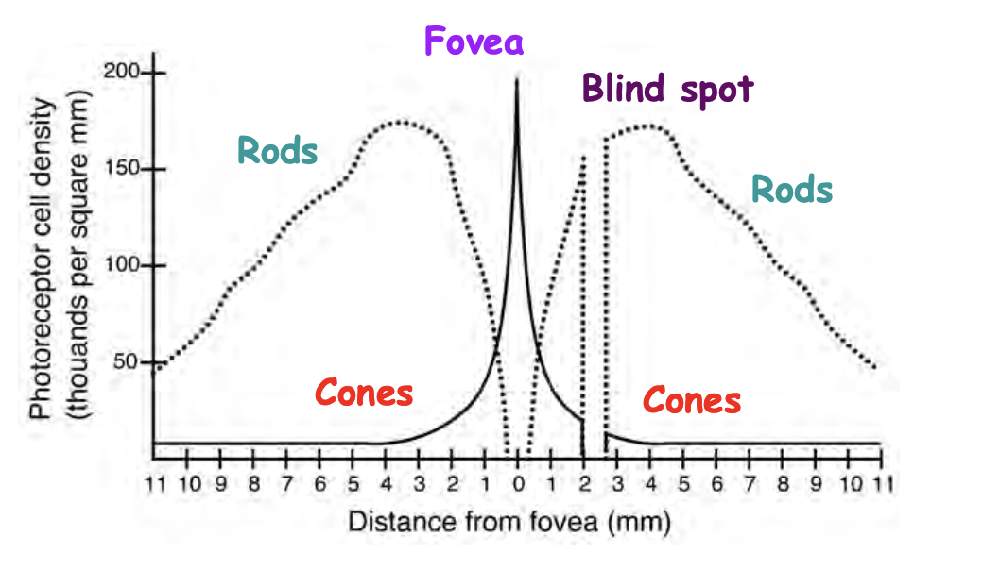
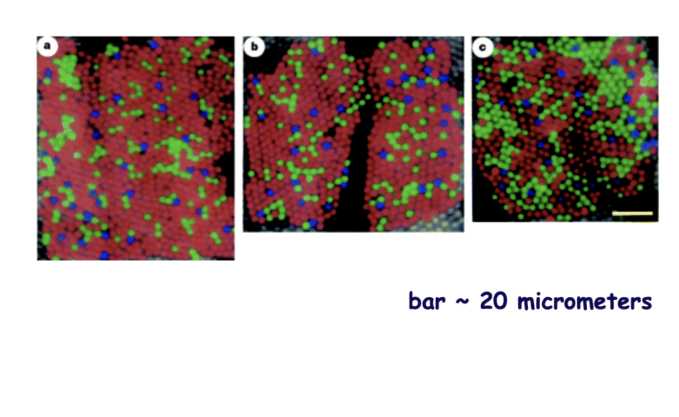
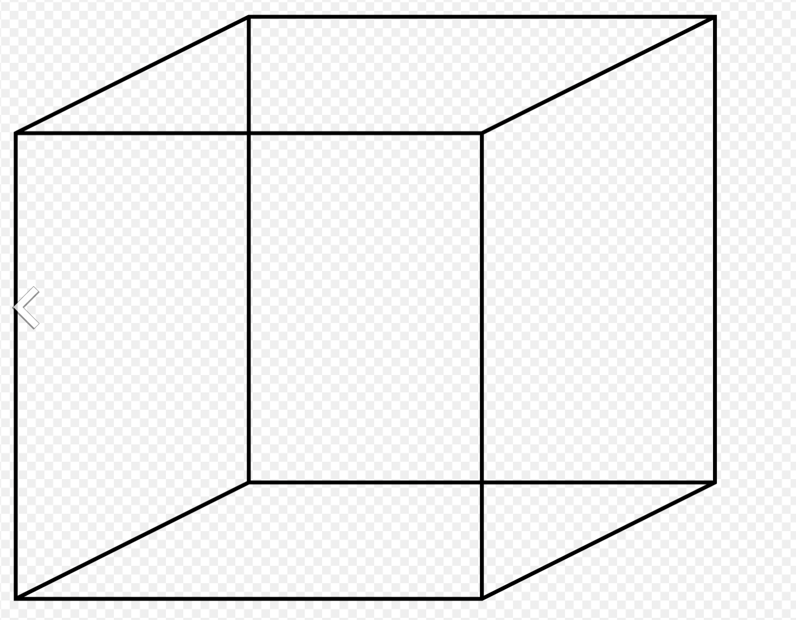

# Lecture Key Concepts 

## **Lecture 1**

**Astronomy and Modern Science**

Evolution from astronomy to physics, chemistry, biology, neuroscience.
* astronomy is the first thing that we looked for (looking to the sky, and our attempt to understand them)
* Understanding: bascially when you can explain something

### Ancient Human Evidence, Human Evolution

Sophisticated human behavior (drawings, music) dates as far back as 50,000 years.
* Very intricate drawings of animals drawn as far back as 45,000 years ago. 

**Clarke's three laws:** 
* When a distinguished but elderly scientist states that soemthing is possible, he is almost certianly right. When he states that something is impossible, he is very probably wrong
  * this doesn't apply to simply the elderly but to anybody
* The only of discovering the limits of the possible is to venture a little way past them into the impossible
  * think about this :D
* **Any sufficiently advanced technology is indistinguishable from magic**
  * think alien technologies

**Human Evolution**

We have a history of 200,000+ years, with divergence from other hominin species around 5 million years ago.
* This means that the hominin species are approximately 4.4 million years old.
* The oldest hominin fossils all come from East Africa
* Recent hominins have indicates of higher mental capacity (ritually bury the dead, having pet animals)
  * See slides for visual on migration of humans around the world

Brain size has substantially increased as evolution went on.
* increase in brain size = higher cognitive capacities? We don't know yet!
* 2001 space odyssey: killing of conspecifics (went from killing animals to killing other hominins)
  * human deaths due to violence in the 20th century alone is ~150 to 200 million
* even though humans can kill other humans also have capacity for compassion, empthy, social connection

**Does HAL have a mind?**

Synopsis: at some point HAL gets the impression that humans are not necessary and might be "in the way" of things. He ends up killing the crew as a result. 

So the question becomes, does HAL have a mind? To begin answering this question, we have to ask ourselves, what does it mean to have a mind? What is the mind?
* mind is the collection of "mental states"
  * i.e. thoughts, feelings, perceptions, **dango**. These are experiences that are irreducably subjective.
  * having a mind means you have an idea of what it's like to be (consciousness)

**Mind-Body Problem**
The question: *How is mind related to physical processes in the brain and the body?* 
* How do we begin to address this as a question of scientific investigation? (i.e. What is our science-based description of reality?)
* what is the connection between the nature of reality and our experience?

## **Lecture 2: Nervous Systems and Brains**

**Rene Descartes**

Famously known for the phrase "I think, therefore I am". He argues that the capacity to think means that he exists. It is the only thing that we can sure about. Published a book called *Discourse on Method* in 1637.

*Treatise on Man*, published in 1662 contains Descartes' thoughts about our capacity to have experience, perceptions, thoughts, and their effect on our body. 

* **Foot near fire**: Descartes was interested in how the sensation of heat was translated from being a sensation to a reaction from the person.

The reason why Descartes never published his work was because Galileo (who lived during his time) was sentenced to house arrest for going against the church. Knowing that his theories about the mind-body problem conflict with those of the Church, Descartes decided not to publish his work out of fear. It was only after his death that his writings were published.

Descartes theorized that there exists something called a "mind-body dualism". He splits the mind-body into two parts, called *res extensa* (extended material domain) and *res cogitans* (subjective experience). Wrestling with the idea of the "soul", Descartes set aside the mind and instead focused on the body and the physical world in terms of mechanisms. **This eventually led to the practice of science.** Only recently has have we turned back and looked at the idea of the soul and subjective experience. 

**Andreas Vesalius:** The guy who drew his dissections on human bodies. 
* He hired ppl to draw

**Charles Darwin, Alfred Wallace**

Formulated the theory of biological evolution: *The diversity of living organisms is understandable in terms of variation and natural selection.* Key takeaway from this? Evolution takes a **lot** of time. 

**Age of the Earth**

In the 1600s it was theorized that the age of the Earth was less than 6000 years. This result had been arrived by tracing back the timeline given in the Old Testament. James Ussher (1581-1656) put date of the Earth's creation at 4004 B.C. (sometime in October)
* Initially this meant that the Darwinian method of evolution couldn't possibly have been correct since evolution needs a lot longer than 4000/6000 years to develop into the complexity we have today.

People then looked at geological strata and fossils (~19th century), and from this people soon realized that the age of the Earth was a lot older than was previously thought. They put the age of the Earth at hundreds of millions of years old
* This made Darwin and Wallace's theories much more plausible than previously thought.

Today we believe that the Earth is 4.6 Billion $(4.6 \times 10^9)$ years old. The oldest of fossils (single celled organisms) appeared approximately 3.8 billion years ago. Modern humans, by comparison, have only lived for 200 million years, which is equivalent ot a very small sliver on the timeline. 
* Eukaryotes appeard around 1.5 billion years ago

**Tree of Life**

Essentially a pictoral view of each organism and their relationship to other organisms. This tree can look really complicated, but it can be split up into three sections:

* Prokaryotic Bacteria: single-celled bacterial organisms
  * a very large number of species and families, one of the most dominant life forms on the planet
* Prokaryotic Archaeabacteria: They're quite different from prokaryotic bacteria, so they deserve a place of their own
* Eukaryotes: multi-celled organisms. Defined as organisms that have nuclear membranes
  * all the organisms which we're familiar with (animals, plants, fungi) 
  * As big as the family of eukaryotes is, it pales in comparison with prokaryotic bacteria and archaebacteria.

**Last 600 million years**

This is the important section for us since it is essentially when all the different types of aniamls emerged. 

* The first animals were around before the first plants were around
* ~800 million yars ago we see evience of sponges, then ~600 million years ago we see arthropods and molluscs. Vertebrates come later. 
* First neurons appeared sometime between the first sponges appeared and the first cnidarians (we know this because sponges don't have neurons and cnidarians do)
  * Roundworms are a popular organism to study for neural activity because they have a relatively small number of neurons (exactly 302 of them)
  * Every neuron and its connections have been mapped, yet we still don't know how it works.
* First brains appeared sometime after cnidarians split but before arthropod split
  * Just like the last one, we know this simply because anything more complex than arthropods are known to have brains whereas cnidarian don't. 

**Different types of animals**
* Cnidarians: reprsented by hydra, jellyfish, etc. 
  * They have nerve nets, but they don't have a cluster of nerves that looks like a brain. 
* Planaria (Flatworms): are signficnatly more complex and also larger than roundworms, and have some form of nervous system
* Arthropods: organisms that clearly have brains 
  * *Drosophila* (fruit fly) has a brain and a nervous system, which has also been studied rather extensively.

**Structure of the Brain**

Basically every single vertebrate brain can be split up into the forebrain, midbrain, hindbrain and spinal cord.
* Spinal cord is essentially a tube that expands into the different parts of the brain
* comparing brains across all species, we can see that mammals have the largest forebrain of all the vertebrates
* Big question: **How does signaling take place?**
  * Descartes speculated that there is some tube that pushed fluid (based on pressures) to sense heat (solution was unknown to Descartes at the time)
  * After electricity was discovered, Galvani discovered that if he hooked up severed frog legs were connected to a battery that they would actually move $\rightarrow$ implies that neural signaling is electrical in nature

**Golgi, Cajal**
They shared nobel prize in 1906. Golgi discovered a way to stain neurons in order to study them. This allowed for nerve cells (such as tissues in the brain) to be stained and visualized.
* Cajal used Golgi's staining technique to draw neurons, which they ended up sharing the Nobel prize for.

They actually disagreed with one another (they rarely spoke to each other)
* Golgi believed that the nervous system was connected together in a "vast web", sending communications in all directions **(reticular theory)**
* Cajal believed that the nervous system were powered by neurons, and they could only signal in one direction **(neuron theory)**
* As it turns out, they are both correct - single neurons are unidirectional, but there is a lot of connectivity between separate neurons
  * Synapse signaling can also go in both directions, meaning that both their theories are actually correct.

*Main takeaway:* The brain is composed of billions of nerve cells (and glial cells), neurons are talked about in a later lecture.

**Comparison of Mammal Brains**

There are a large number of grooves in the forebrain (cerebrum)
* gyrus/gyri = bumps on the brain
* sulcus/sulci = grooves on the brain

The reason for these bumps and grooves is to maximize the surface area for a given volume. There are approximately $10^{11}$ (100 billion) nerve cells (neurons) and approximately the same or more number of glial cells (glia) also exist. 
* There are also trillions of synaptic connections between cells

**Structures of the Brain**

* Gross anatomy: anatomy that doesn't require a microscope to see.
  * **Central sulcus:** separates the frontal lobe from teh parietal lobe
  * **Corpus Callosum:** The bridge between the left and right hemispheres of the brain. Contains approixmatley 200 million axons.
  * **Cerebrospinal Fluid:** The fluid that flows throughout the entire brain and the spinal cord.

There are a lot of different views of the human brain, see the slides for images, I'll try my best to describe them here:
* **Dorsal view:** Looking at the brain from the top, cerebral cortex refers to the sheet that wraps around the brain. The frontal, parietal, and occipital lobes are visible from this angle.
* **Ventral view:** The underside of the brain. The frontal and temporal lobes can be seen from this angle. We can also see the cerebellum and brainstems. Olfactory lobes can also be seen, but we don't need to know this.
* **Lateral view:** This is the view in which all four (frontal, parietal, occipital, temporal) can all be seen. Other structures like the central sulcus, the lateral fissure (separates the temporal and frontal lobes) can also be seen.
* **Medial view:** This is the view where we no longer have a complete brain but instead a "slice" of brain. 
* **Anterior, Posterior:** Refers to looking at the brain head on or from the back.
  
There are also four sections of the brain to memorize:
* Frontal Lobe 
* Parietal Lobe
* Occipical Lobe
* Temporal Lobe

The brain consists of two hemispheres, each of which contains these structures. 

**Brain cross sections**
Slicing through the brain head on is called a "frontal section" or "coronal section"
* from here we can see the gray matter (i.e. cell bodies), white matter (the actual nerve fibers) and ventricles (cavities that are filled with cerebrospinal fluid)

Slicing through the brain from a lateral view is called a sagittal section. It can be called a medial section if it happens to be on a medial line, but it doesn't have to be.
* there are also parts on the skull (the places where your skull grows into place) that are named after the same planes
  * i.e. there's a coronal suture as well as a saggital suture 

**Forebrain structures**
* cerebral cortex (this is what we most commonly call the brain) $\rightarrow$ this is also most of the forebrain
* Basal ganglia
* Limbic system: hippocampus, amygdala, etc.

Underneath the forebrain we have the brainstem, which contains the diencephalon, midbrain, hindbrain, and cerebellum. 
* midbrain has various other structures that deal with channeling sensory information into the cortex
  * superior colliculus, inferior colliculus
* Cerebellum is usually grouped together with the hindbrain but it really deerves its own classification.

The brain is full of blood vessels - the brain absolutely requires energy and a lot of blood flow. 
* this brings glucose and oxygen to nerve cells
* There are three major arteries: anterior, middle and posterior cerebral artery. 
  * if any one of these arteries were to be blocked it's what we call a stroke - can cause death or disabilities.

**Brain Tissue**

The brain has a protective tissue that covers the surface of the brain. These are callede the dura mater, arachnoid space, pia mater.
* dura mater is one of the layers of what is called the meninges.
  * very thick material, very touch
* arachnoid/subarachnoid space: contains lots of blood vessels
  * cerebral spinal fluid is the fluid present bewteen teh arachnoid and pia mater layers
* pia mater is the last layer before we get to the surface of the brain 

## **Lecture 3: Molecular Structure**

**Chemistry:** the science of investigating transformations of matter. It's only a 300-year old discipline. It's derived from alcehmy, which studied transformation of matter along with psyche.
* It was this mix of "matter and mind", but matter and mind have been very separate in modern science

**Organization of Chemical Elements**

Today it's called the periodic table, the first person to create such a table is Dimitri Mendeleev (1834-1907). The chemistry of life is only concerned with hydrogen, carbon, nitrogen and oxygen. These four elements combined will gives us 96.5% of all the mass of a living human body. If we add a few other (e.g. calcium), then we get approximately 98%. Adding Na, K, P, Cl then we get to 99.8% of life. Adding in Mg, Mo, Mn, Fe, Co, Cu, Zn, S, Se, and I will give us 100% of the animal body mass.

**Ions:** when an atom either gains or loses one or more electrons
* Basically these are charged (either positively or negatively) particles. 
* Atoms have tendencies to either gain or lose electrons based upon their outer shell. Elements on the left side of the table more easily *lose* electrons and form cations, elements on the right more easily *gain* electrons and form anions.
  * e.g. $\ce{Na}$ tends to become $\ce{Na+}$ and $\ce{Cl}$ tends to become $\ce{Cl-}$.
* Noble gases don't react due to their full outer shell.

Elements can be ionically bonded to one another by donating/receiving electrons. This creates a charge imbalance which causes the attraction.
* Salt, or $\ce{NaCl}$ is an example of this, where $\ce{Na+}$ denotes the cation and $\ce{Cl-}$ is denotes the anion.
* Salt dissolves easily in water and becomes these individual ions.
  * Salt (and other ionic compounds) experience a lower energy state if they are dissolved in water as opposed to staying in crystal form.

**Molecules:** atoms joined together by covalent chemical bonds (sharing of electrons)
* Water, $\ce{H2O}$ is an example of this. However, there is an unequal sharing of electrons. The electrons spend more time in the oxygen atom than the hydrogen atom, causing a phenomenon known as **polarity**
  * The oxygen is slightly more negatively charged, and the hydrogen is slightly more positively charged

When $\ce{NaCl}$ enters the $\ce{H2O}$ the polar property of water means that the slightly negative parts attract themselves to the $\ce{Na+}$ and the slightly positive to the $\ce{Cl-}$, which causes the salt to dissolve. 
* Every ion is surrouned by water molecules.

**Hydrophilic/Hydrophobic**

Hydrophilic refers to the *affinity* to water. Any polar molecule or ion is hydrophilic. The chemistry of life is essentially water-based chemistry $-$ we evolved from the sea and more than half of our body is seawater (i.e. salty water)

Hydrophobic substnaces are ones that are nonpolar. These are generally oily substances (hence why water and oil don't mix)
* An example of this is methane, which is completely nonpolar. All saturated hydrocarbons are nonpolar.

Consider ethyl alcohol (sometimes called ethanol). It has a hydrocarbon component, which is nonpolar, but there is an $\ce{OH}$ group, meaning that this part of it is polar. This means that ethanol is compprised of both a hydrophobic and hydrohpilic portion. If we extend this out for larger hydrocarbons (e.g. octanol), then the hydrophobic portion becomes much larger. 
* Even though octanol will be slightly soluble (because of the $\ce{OH}$ group), it will largely prefer to stay away from water.

**Amino Acid**

Amino acid is a structure that has an amine base as well as a carboxylic acid group. There is also an $\ce{R}$ group that denotes a radical, which can represent a large variety of possible side groups.

All these molecular structures are examples of organic chemistry.

**Cyclohydrocarbons**

These are hydrocarbons that form a ring instead of a straight chain. Cyclohexane is a ring of six carbons, and so is benzene. The difference between the two is that benzene has a delocalized ring of electrons whereas cyclohexane only has single bonds between carbons.
* This difference gives these two chemicals very different properties.
* Sometimes people write the benzene with a circle inside in order to show that each of the carbons are essentially sharing 1.5 bonds. 

**Structural line diagrams**

Basically a simplified way to draw a chemical. The line diagram omits the carbons and hydrogens and replaces them with lines, but any other atom and hydrogens connected to those atoms are drawn. (e.g. $\ce{NH}$ would still be drawn)

**Biological Macromolecules**

**Carbohydrates:** These are sugars, starches, and they are essentially energy sources and used for energy storage. 

**Fats, lipids, oils:** These are also energy sources, they are very important as they are the fundamental building block of cell membranes.
* They generlaly have a very small number of oxygen atoms since they are generally nonpolar. 
* They have very long chains of hydrocarbons (which are nonpolar)

**Phospholipids:** Used by all organisms to create cell membranes.
* Consists of a phosphate head and a hyrdocarbon tail. 
* Phospholipid tails can have double bonds (called unsaturated phospholipids), which causes a small kink in their structure. 
* Note that the molecule has a hydrophilic head (since it's polar), but has a hydrophobic tail (since it's nonpolar)
  * We sometimes also write that it has a lipophobic head and lipophilic tail. 
* These phospholipids create a bilayer, with the hydrophobic tails pointing inwards and hydrophilic heads pointing outwards. 
  * These arrangements are spontaneous
* What you end up getting is a giant three-dimensional sheet of phospholipids. This is the mechanism that all cells use to form cell membranes.

**Proteins:** Usually depicted as clumps that are inserted into the phospholipid bilayer. It's important to note that these proteins come in many different sizes.
* Ion channel proteins are a specific type of protein which is embedded inside the phospholipid bilayer
  * It allows charged particles to pass through the bilayer. 
* They are **chains of amino acids** linked by chemical bonds.
  * Typically several hundred amino acids make up a protein.
* Amino acid is essentially a carbon, an R group, an amino group (amine) and a $\ce{COOH}$ group around that central carbon.
* Amino acids join together via peptide bonds (similar to an ester bond except with nitrogen instead of oxygen)
  * These peptide bonds also require some enzymes that allow this chemical reaction to occur. Without them this reaction is also impossible.
  * This chemical reaction also produces water as a by-product
* Because proteins are so complex we also like to draw them with spirals and lines to simplify their diagrams a little.
  * Because they also form large chains they also exhibit protein folding.

**Levels of Protein Strucutre**

**Primary:** linear sequence of amino acids in the chainchian

**Secondary:** folded structures due to interactions between nearby atoms. 
* Basically this refers to the helix structures that you see due to interactions between atoms of one amino acid and another. (e.g. alpha helix)
* Linus Pauling was the one who discovered the alpha helix
  
**Tertiary:** Overall three-dimensional shape of the protein
* These chains will fold in unique ways to form complex proteins

**Quaternary:** Functional protein is formed by multiple subunits $-$ multiple polypeptide chains come together as subunits to form a functional protein.
* An example of this type of protein is the ion channel protein. Five subunit polypeptide chains come together to create a functional protein.

**Nucleic Acids:** They are the building blocks of DNA and RNA, with DNA standing for deoxyribonucleic acid and RNA standing for ribonucleic acid. They are carriers of information fo inheritance, and they regulate functions and catalysis.
* viruses are either DNA or RNA viruses, COVID-19 is an example of an RNA virus.
  
**Dimensions of moleucles and cells**

**Angstrom:** 0.1 nanometers, or $10^{-10}$ meters. By comparison, small molecules are 0.5 nanometers, or 5 Angstroms.
* water is approximately 0.3 nanometers and dopamine is approxamitely 0.9

Diameter of molecules and cells get larger. Cell membranes are approximately 5 nanometers in thickness, and the diameter of a medium size protein is also approximately 5 nanometers. Viruses, by comparison, are on the order of 100 nanometers. 

DNA is by far the largest molecule in the human body, but it is only about 2 nanometers in thickness. The length of DNA can be up to several centimeters, meaning that the molecule must be packed very tightly, hence the nucleus. A typical red blood cell is 8 micrometers (8000 nm), whereas a bacterial cell is approximately 10 nanometers

Nerve cells are 5 to 100 micrometers, whereas the neuronal synapse gap is 20 nanometers, or 0.02 micrometers. 
* Note that the nerves themselves are very long, but the nerve gap is very short!

## **Lecture 4: Molecular Biology**

**Gene:** a notion of some kind of fundamental unit of heredity
* comes from teh biological science of genetics, has its roots from the greek word *genesis*, meaning birth
* selective breeding of plants and animals have been practiced for thousands of years
  * we know that inheritance happens as a result of genes
* It was Darwin who said that all the variability of animal speceis could be explained via natural selection. 

**Gregor Mendel:** The guy who bred peas together to figure out the patterns behind inheritance. He discovered that traits segregate and sort in an orderly fashion during reproduction.
* Traits would move from generation to generation in an orderly way 

**Neils Bohr:** Heisenberg Uncertainty principle $-$ the idea that you cannot measure the momentum and location of a particle with infinite accuracy.
* He's making that analogy to studying life, saying that it's impossible to study living beings because they have to be dead for you to study them.
  * "we should doubtless kill an animal if we tried to carry the investigatin of its organs so far that we could describe the rold played by single atoms in vital functions ... and the idea suggests itself that the minimal freedom we must allow the organism in this respect is just large enough to permit it, so to say, to hide its ultimate secrets from us."
  * But he rephrased this as encouragement to biological science, claiming that physics had recently gone through the same thing.

**Max Delbruck:** One of the first people to observe atomic fission with Otto Hahn. Delbruck was the only person who received the Nobel prize for it, even though Hahn and him had worked together on it.
* He was the first person to propose that genes are large molecules $-$ this was a completely new way of viewing genes
* Studied *E. coli* bacteria in order to study heredity
  * this was smart since *E. coli* reproduces really quickly so you don't have to wait long to see the results of your experiment.

**Bacteriophage:** A virus that specifically targets bacteria. Its host cell are the bacteria, just like how the host cells for COVID-19 are human cells.
* In the case of COVID the spike protein contacts the cell membrane and does one of two things: attach to the cell membrane and releases its genees to produce more copies immediately, or becomes absorbed into the cell before releasing its genes. In both cases the genes are released and this causes the cell to create more copies of the virus. 
* Bacteriophages attach themselves to the surface of the bacteria, and then inject their genes into the bacteria
* **Viruses carry genes. They are simple $-$ consist of proteins, nucleic acids, and lipids.**

At this point in time it was believed that genes are made up from proteins since other molecules are just too simple to form genetic information. Proteins, on the other hand, have some complexity to them (20 different amino acids), which they thought could account for the diversity of genetic information. (imagine $20^{500}$ different possibilities). 

**Oswald Avery:** The first person to claim that DNA carries genetic information. He was able to track the transfer of genes from one bacteria to another, and definitively show that DNA was the actual carrier of genetic information. But nobody ever paid any attention to him, since it didn't fit with their prior model of proteins. 

**Hershey-Chase Experiment:** The one experiment that concluded that DNA was the carrier of genetic information.

**Part 1**
* Grew virus in nutrient media containing radioactive sulfur
* Any radioactivity from the sample had to go into the proteins and not amino acids, since amino acids don't contain the element sulfur. (DNA is made of C, H, O, N). 
* They fed the bacteria with radioactive viruses, and they wait for the virus to do its thing.
* Their idea was to interrupt the process of the virus attaching itself (right after the genes are injected). They agitate the viruses off the bacteria by using a blender, and they centrifuge the sample. 
  * Since the bacteria is more dense, it goes to the bottom. So they spun it just long ehough to cause separation bewteen the virusese and bacteria. Their results find that the radioactive portion is still in the liquid (supernatant), and not the bacteria. This means that the genes that were injected did not contain any radioactive substance, meanign that it couldn't have been protein that was injected. 

**Part 2**
* They grew virus in nutrient media that contained radioactive phosphorous (this is essentially the opposite experiment of what they were doing last time)
* Since amino acids don't use phosphorous, only the DNA will be radioactive and the amino acids will not. 
* They repeat the same experiment with the blender, and discover that this time, the radioactivity is found in the bacteria $\rightarrow$ allowing them to conclude that the genes must have been transferred. 
* From here they were able to conclude that DNA is the carrier of genetic information in the viral infection of bacteria. 
* This encouraged many people to study DNA and discover how it stores genetic information.

**Watson and Crick**

The first people who discovered the double helix structure of DNA (*Book suggestion: The Double Helix by James Watson*). However, they were not the first person to theorize this. Rosalind Franklin had produced, via x-ray diffraction, an image of DNA, but it was Watson and Crick who first interpreted this as a double helix structure. 

DNA is comprised of four building block: Adenine, Thymine, Cytosine and Guanine. They also wrote about the fact that there is interaction between the two strands of DNA via hydrogen bonding. They also theorized that the fact that ATCG has a specific pairing (A-T, C-G) that it is possible to copy DNA quite easily. 
* This is because each individual strand of DNA is complimentary to the other strand, meaning that the information on one strand is enough to solve for information on another strand. 
* Watson sent a letter to Max Delbruck shortly following their discovery, in which he detailed the structure of DNA and the pairing bewteen A-T and C-G. Delbruck, upon reading this, immediately thought it was true. 

So now the Gene went from some abstract kind of fundamental heredity to a sequence of nucleotides (A, G, T, C) that's found in DNA. The genetic code we refernece is the relationsihp between DNA nucleotides and the amino acids in proteins. They ended up figuring out (after 10 more years of experimentation) that 3 nucleotides (also called a codon) forms one amino acid.
* There's something called the table of genetic code you can refernece to figure this out. 

**DNA Transcription:** The process of translating DNA. First, it goes from DNA to RNA, and then from RNA we can decode that information into specific amino acids. Note that during the transcription from DNA to RNA that thymine becomes uracil. 
* Transcription $\rightarrow$ DNA to RNA
* Translation $\rightarrow$ RNA to amino acids
* This is essentially how mRNA vaccines work. The vaccine contains a portion of the virus's RNA code, and it uses the human body to produce a part of the spike protein that resembles the virus. Then the immune system reacts to this and learns of the new virus. 

**Hypothesis of Evolution**

We now know that the variation in genetic information comes from the variation in DNA. More specifically, DNA arranged in a different order will produce a different set of amino acids, which account for its diversity. This is an elegant solution to an otherwise unsolved problem.
* We now know that DNA and RNA also conserve regulatory functions and catalysis. There are some situations where RNA actually behaves like an enzyme and acts like a catalyst. 

Max Delbruck was finally awarded the Nobel Prize in 1969 for doing the original experiments that got the field started (his view on DNA being the carrier of information). Nobody believed that the resolution to the problem would be so simple, but that's the way it turned out.

## **Lecture 5: Neural Signals**

**Diffusion:** The concept that things often flow from a region of high concentration to a region of low concentration. This also happens with ions $\rightarrow$ when you add salt to water, the salt diffuses into the water until it's uniformly distributed. We can introduce barriers into this diffusion process to control what diffuses over and what doesn't.

These barriers are split into two kinds - impermeable and semi-permeable barriers. 
* Impermeable barriers are onn es that don't allow anything to pass through, a good example of this is the cell membrane, whihc doesn't allow a charged ion to pass through on its own. 
* Semi-permeable barriers: under some conditions, it will allow only a *select* number of molecules through, but without these conditions they act like a solid wall. This is the mechanism that exists in most living organisms.
  * They usually only allow negative ions to pass through and not positive ones.
  * The charge imbalance on either side of the barrier will cause the negative ions that once passed through to be pulled back through. 
  * The balance of the concentration is not simply a function of equalizing the concentration, but also a function of the electrostatic attraction between individual ions. 

**Ion Channel proteins:** often gated proteins. They will only be permeable to specific ions (e.g. chloride ions).

**Conditions for Ion Channels**

With time, there will be an ion difference (and charge difference) built up surrounding the neuron since the ion channels only allow specific ions to pass through. Outside the neuron, the concentrations of sodium, chloride, and calcium are all higher than inside the neuron. Inside the neuron, the concentration of potassium is phigher than the concentration outside the neuron. 
* There's no choice but to simply remember this fact!

This differnece in ionic concentration gives rise in the difference in electric charge, whihc is expressed as an electric potential (voltage) between the outside and inside surfaces of the axon. This is called the resting potential, and is approximately -65 millivolts. (called the resting membrane potential)
* By convention, we choose the potential inside the neuron to be negative. This is becuase there's more positive charge outside compared to inside (hence the negative). 

Across a couple million neurons, this is actually a lot of potential difference.

**Ion Channels**

When ion channels open, it allows potassium ions to flow out or chloride ions to flow in (via diffusion principles). This causes the interior of the neuron to become more negative (since positive charge is flowing out and negatives are flowing in). 
* Either one process or both could occur. 
* This produces a decrease in potential from -65 millivolts (resting) to -70 millivolts
* This is a process called **hyperpolarization**
  * think of this as what happens to the membrane potential. At -70 millivolts, the neuron is *over*-polarized, hence the "hyper-" prefix. 

When an ion channel opens, sodium and calcium ions can also flow in, leading to an increase in potential. Thus, this process is called a *depolarization*, since the potential becomes closer to zero. (this is about -60 millivolts). 

**Conditions for neuron firing**

When a neuron decides it's going to fire, it will start the signal from what's called the "axon hillock" (the point where the axon joins with the cell body)

The signal then travels down the axon to the axon terminals, which then transfers that signal to the next one down the line. 

**Hodgkin, Huxley, Squid axons**

They chose squid axons because they are relatively large, to the point where it's possible to insert an electrode into the axon.
* This allowed them to do experiments to record the voltage of the axons 
* Published a one-page paper describing their discovery on action potentials inside nerve fibers.

They discovered that the potential of an axon has a negative "resting energy" (i.e. the rest potential), but during the firing the voltage goes up rapidly (called the action) then comes down rapidly as well. 

Took them a couple more years to figure out what they had initially discovered, and came up with a hypothesis: they predicted that there must be soemthing called a "voltage-gated ion channels"
* These are ion channels that open and close as a function of membrane voltage. They were discovered a couple years after the publication of their results.

**Action Potential Process**

The axon starts at -65 millivolts, goes up to +30 millivolts then comes down again. 

Here's the process: 

1. Voltage-gated sodium channels open up, increasing the potential since sodium flows into the cell. 
2. Voltage-gated sodium channels close.
3. Voltage-gated potassium channels open, decreasing the potential since potassium flows away from the cell.
4. Voltage-gated potassium channels close. 
5. Things take a moment to stabilize

It turns out that in the beginning of the action potential, both the sodium and potassium channels open, but the sodium one just opens much quicker which is why the sodium flow dominates the first half of potential. Then the sodium channels close, leaving the potassium channels the only ones that are open, which decreases the potential back. 

Voltage-gated channel proteins are controlled by potential differences in the membrane, which is then a representation of the relative forces that are literally changing the shape of the protein. We've since been able to image these proteins using fancy technology.

After firing, the neuron needs to take some time before it can fire again, and this is called the **refractory period**. If another action potential tries to initiate, the neuron won't fire becuase they need time to relax. The locations of high concentration of ion channel is located on the axon hillock, and then all the way down the axon as well. 

Once an action potential is initiated, we consider it an "all or none" type situation and it's also unidirectional. This means that when it fires there's no way to stop it. Once it's triggered, there's a cascade of sodium and potassium ion channels that open and close which propagate the signal down the axon.
* The best way to remember this is simply to imagine a domino effect. 
  * Another way to think about the refractory period is to imagine having to set the dominoes back up so you can knock them over again. 
* The sodium channels that come in activate the next set of potassium channels and that's how the curretn travels down the axon.

Note that all of this is highly dependent on the concentration differences in charged ions. After a couple of firings, notice how the concentration of sodium starts to become in equilibrium, as well as potassium. This leads to a lack of a concentration difference, or in other words, the neuron can't fire for a while. 

Note also that the signal doesn't travel the opposite direction because of the refractory period, which prevents the previous voltage-gated channels to start firing again.

**Restoring potential differences**

There's a protein called the sodium potassium pump, which reverts this change. The job of the pump is to pump sodium back into the neuron, and pump potassium into the neuron.
* It accomplishes this by using energy (ATP = adenosine trophosphate)
* For each ATP molecule there's 3 sodium ions that leave and 2 potassium ions that come in, so there's lots of ATP being used in the process of restoring electric potential!
* The $\ce{P=O}$ bonds are where all the energy is stored, and the pump converts this bond energy into energy that pushes the ions in their respective directions.
  * These pumps are a large contributor to our body's energy consumption. About a quarter of the food we eat goes into powering these pumps

**Channels vs. Pumps**

Both of these structures are membrane-spanning proteins (i.e. they are both proteins). However, channels are passive and allow substances to move across down concentration gradients. In other words, they don't require any energy to operate $-$ the ions naturally flow to the state of least energy. Pumps, on the other hand, require energy to operate since they are "fighting" the natural tendency of lower energy, thus requiring ATP. 

A neural impulse (unmyelinated) travels at a speed of less than 10 meters per second. Usually, this isn't fast enough, especially if we're talking about signals that go from the brain to the feet. 

**Nodes of Ranvier**

He was the guy who called the coating around the axon "myelin", and the gaps found in the myelin are named after him, called the nodes of Ranvier. 

The question is, how does sodium and potassium cross the membrane, if the membrane itself is covered in a layer of myelin?

To answer this, we look at the gaps between the myelin coating. The gap (called the **internode interval**) is approximately 300 to 2000 micrometers in length. The ion channels and sodium potassium pumps are all located in this gap. 

For unmylenated axons (some are naturally unmyelinated), the sodium channel density per square micrometer is about 100, but for myelinated ones it can climb up to more than 10,000 channels per square micrometer.
* This is simply due to the fact that everything must be crammed together at those nodes 

In the myelinated axons, the action potential starts at the hillock, and the sodium channels open allowing the sodium to flow in. The sodium diffuses very quickly and reaches the next gap in the myelin, and it opens the voltage gate at this gap. When these open, the same process repeats itself and propagates down the axon.

As a result, the action potential, rather than slowly moving down the length of the axon, it essentially jumps from one node to the next. This is analogous to a bus that stops at all places and one that stops at few places. Of course, the one that stops less is going to travel faster. 
* This pushes the signal speed to about 100 meters per second (or aproximately 200 mph).
* This is something that's only found in vertebrates.

Myelin speeds up the nerve impule propagation via something known as "saltatory conduction", stemming from the latin root *saltare*, meaning *to dance.* 

Seeing the cross section of the axon, we can see that the myelin is formed of several layers, and it itself is a cell. It's part of a family of cells called the oligodendrocyte glial cell. Essentially, its function is to form the myelin by wrapping itself around the axon multiple times. 
* Looking at the myelin in particular, we see that it's made up of about 40% phospholipid (fatty parts), 30% cholesterol, and 30% protein.
  * The proteins that are present here are ones that basically prevent the myelin from unwrapping. 
* In the CNS, a single oligodendrocyte glial cell can sheath multiple chunks of myelin or myelinate multiple different axons.
* In the PNS, the myelin has a different structure
  * Here, they're called schwann cells. 
  * Each schwann cell contributes to a single chunk of myelin

*A small note about Schwann:* Schwann was very interested in the idea that all animals share this type of "connection" in the way they transmit signals throughout the body

**Multiple Sclerosis**

MS is an autoimmune damage to myelin, meaning that signals can no longer travel as fast down the axon. 
* Multiple and largely unknown causes, nerve conduction is impaired
  * can manifest itself as the loss of different sensory capabilities (e.g. sight)

## **Lecture 6: Synapses**

Remember Cajal and Golgi who had different ideas about how signals were being transferred? Turns out they are actually both correct, since there are differnet types of synapses: chemical and electrical.
* Usually the ones that we hear about are referring to chemical synapses, but there is a distinction here. 
* Electrical synapses send electrical pulses to the next neuron through a **gap junction**
  * Connexon channels (made of indivudla conenxin) are the structures from two nerve cells that connect together in order to make a connexon channel. 
  * The gap betewen these two connexons is approximately 3 nanometers (very small!)
  * The signaling is bi-directional, meaning that it could go both ways. 

Chemical synapses are found at the axon terminals of a particular neuron. The gap between the axon terminals and dendrites of the next neuron is approximately 20 nanometers, called the synaptic cleft. In this cleft, there's a lot of proteins there, so it often shows up pretty dark on scanning microscope images. 
* Dendritic spines are little protrusions of the dendrite that increase its surface area, allowing it to form synaptic connections with axon terminals.

**Components of a Chemical Synapse**

* Pre-synaptic cell is the one where the signal is coming from.
* The voltage-gated sodium and potassium channels induce a reaction to the voltage-gated calcium channels, causing calcium to flow into the cell. 
  * The inward flow of that calcium triggers a process that results in the movement of the synaptic vesicles
  * This then triggers a fusion between the membranes of the vesicles with the outer layer of the neuron, thereby releasing neurotransmitter molecules. 
    * For the purposes right now you can think of each vesicle as containing only one kind of neurotransmitter. 
  * This release of neurotransmitter happens very quickly and the neurotransmitter receptors (postsynaptic) bind to these neurotransmitters and send the signal down the line. 
* Reuptake transporters take back the neurotransmitter and bunch them back up again into vesicles. 
  * Note that this is very important for the unactivation after release. 

**Otto Loewi:** came up for the experiment of chemical neurotransmission in a dream. 
* Transferred fluid from one beating heart to another (without stimulation from the vagus nerve), and found that its beating had also decreased
  * conclusion: there must be some water-soluble substance that is released by the stimulation of the vagus nerve, which causes the second heart to also slow down.
  * He called this stuff the *Vagusstoff*, later identified as acetylcholine (ACh). 

**Other neurotransmitters?**

**Glutamic acid/Glutamate:** One of the most common neurotransmitters found within the brain. 
* This is the primary exitatory neurotransmitter in the human brain (most abundant)

**GABA:** stands for gamma-amino-butryc acid
* This is the primary inhibitory neurotransmitter in the human brain (second most abundant)

GABA is also made from glutamate via an enzyme called glutamic acid deoxyribolase. Its job is to cleave off the carboxylic acid group from glutamate and turn it into a hydrogen.

**Exitatory/Inhibitory**

Excitatory neurotransmitters makes the receiving cell more likely to fire. Inhibitory neurotransmitter makes the receiving cell less likely to fire. 

The way this works is that the dendrites will change the potential of the cell to dictate whether it is going to fire or not. If enough is released to push the potential above -50 millivolts, then it will open the sodium channels and a signal will be generated. 
* Excitatory ones will push it up, inhibitory ones will push it down. 

**Ionitropic receptor/Ligand gated channel:** one of the postsynaptic neurotransmitter receptors. When neurotransmitter binds to the receptor it allows ions to pass through, hence it's called a ligand gated channel. 
* Since they're channels, then this means that ions flow from high to low concentration.
* If positive ions flow into the cell (e.g. the ones that accept glutamate), this is an excitatory effect, since it contributes to increasing action potential. (*depolarization*)
  * ionotropic glutamate receptors are channels for sodium and calcium, and are excitatory due to the reasons listed above. 
  * They generate an **EPSP (excitatory post-synaptic potential)**
* If negative ions flow into the cell (e.g. the ones that accept GABA), this is an inhibitory effect, since it contributes to lowering the action potential. (*hyperpolarization*)
  * These generate an **IPSP (inhibitory post-synaptic potential)**
* 

It's essentially a sum of these EPSPs and IPSPs that contribute to whether the neuron will fire or not. There will be some ultimate change at the axon hillock which will determine when the neuron will fire.
* Timing matters too! If they are closely following one another they can constructively interfere and have a greater effect. If they occur far apart then they wontwon won't really affect each other.  

**GPCR**

Called the G-protein coupled receptor (GPCR). They are also called the metabotropic receptors. This is a really complex process! 

The process:
1. neurotransmitter binds to the GPCR, causing deformation in the receptor
2. deformation causes deformation in GTP (guanesine triphosphate) and causees it to detatch from its binding (GDP and G-protein split up, and GDP becomes GTP)
3. GTP then interacts with an effector enzyme (it produces some effect by catalying some cellular process)
   1. e.g. Adenylate cyclase 
   2. This process produces cAMP (cyclic AMP) $\rightarrow$ signaling molecule in cells
4. cAMP can then interact with other structures within cells (e.g. protein kinases)
5. protein kinases activates some other substrate protein, and this then translates into cellular effects
   1. These cellular effects can be ion channels, metabolic pathways, gene transcription

**Things to remember:** 

* There is a very large diversity in the effects that we can observe. The GTP can affect different effector enzymes, and each of them can activate different moleucles, etc.
* Amplification: there is a cascading effect where a single neurotransmitter can activate multiple things leading to an amplified signal
  * This is different than an ionotropic receptor $\rightarrow$ one receptor does one thing, but GPCR does multiple things.
* All known neurotransmitters have their respective GPCRs 

## **Chapter 7: Neuroanatomy**

CNS (Central nervous system) revers to the brain and spinal cord, PNS (peripheral nervous system) refers to everything else (sensory, muscle, autonomic, enteric).
* enteric is internal organs

**Cranial Nerves:** Connections between the central nervous system and the peripheral nervous system. There's 12 of these nerves. 

**Sympathetic vs parasympathetic**

These are two parts of the autonomic nervous system (auto- prefix meaning automatic)

* Sympathetic = fight or flight
  * anything to do with high stress situations is regulated by SNS
  * **Neurotransmitter responsible:** norepinephrine
* Parasympathetic = rest and digest
  * anything to do with relaxing your body is regulated by the PSNS
  * **Neurotransmitter responsible:** acetylcholine 

Agonists and Antagonists are molecules that either activate or deactivate specific neurotransmitter receptors
* agonists bind to the neurotransmitter and antagonists block them from binding
  * they have similar shape to the actual neurotransmitter but doesn't have enough effect to activate it

**Sympathomimetic/Parasympathomimetic**

* These are drugs that mimic the effects of either norepinephrine or acetylcholine. The "mimetic" suffix means to mimic.
* Sympatholyic drugs are ones that block neurotransmitters that activate sympathetic nervous system. (more complicated definition)

Eye dilation is a response to the sympathetic nervous system.
* Eye drops for retinal examination are used to open it up so doctors can examine the retina. 
* using a combination of sympathomimetic and parasympatholytic drugs will have a stronger effect.
* Molecules that are agonists to sympathomimetic drugs are called sympatholytic drugs. Parasympatholytic drugs are agonists to acetylchloine
* Sympatholytic = parasympathomimetic becuase of homeostasis, and vice versa. 

**Afferent vs Efferent**

Signal direction is characterized as either efferent or afferent. Efferent refres to the signal going away from the brain, and Afferent refers to going toward the brain.
* sensory signals are Afferent because they go to the brain, and motor ones are efferent because they go from the brain.
* resting vagus nerve activity is called the vagal tone
  * increased vagal tone = increase nerve activity

**Mindfulness:** the practice of focusing on your surroundigs and the things you're currently doing.

**Neuromuscular Junction:** The connection between muscles and nerves that tell them to constrict in specific ways.

**Acetylcholine Circuitry**

There's four different neurotransmitters we need to know (acetylcholine, dopamine, )

The Basal forebrain nuclei and midbrain pontine nuclei are sites where acetylcholine is released, the Raphe nuclei is the site where serotonin is released, the Ventral tegmentum and Substantia nigra are places where dopamine are released and the Locus coeruleus is where norepinephrine (noradrenaline) is released.

**Serotonin**

Serotonin comes from tryptophan (an amino acid) and turns into 5-hydroxy-tryptamine (5HT). They are biosynthesized in the regions in which they are released. When these neurons are activated, they release these chemicals to the rest of the brain.

Dopamine is a notable neurotransmitter that doesn't go through all the brain. It only hits the frontal lobe.

**Monoaminergic Nerve Fibers**
 
These are nerve fibers that emerge from small clusters of cells in the brainstem and innervate the entire nervous system.

**Neurotransmitters** 

These are chemicals that come in various differnet forms, they have a large variety of shapes. They also come in various different forms: some are amino acids, some are made from amino acids, others are small molecules, peptides, and also other exotic neurotransmitters.

Seizures happen when there's an overstimulation (runaway reaction) of neuron receptors. We can identify seizures by looking at EEG activity. 
* They're often idiopathic - they appear spontaneously, no known causes
* There are genetic and developmental components
* Treatment methods often involve manipulation of voltage gated sodium, calcium, and potassium channels
  * agonists towards GABA, antagonists towards glutamate.

**Botulinum**

It essnetially stops the vesicles from diffusing neurotransmitter, causing paralysis.
* it interferes with vesicle fusion and disrutps release of neurotransmitter.
* There's a reduced effect of acetylcholine at 
  * In soft cases this manifests as muscle weakness, but in serious cases this causes paralysis.
* The $LD_{50}$ is 2 nanograms per kilogram.
* Also branded as botox 

Everything is a poison given in the right amount. A chemical that is considered a medicine and poison at the same time is called a *pharmakon*.

## Lecture 8: Pharmakon

<!-- paste lectures 8, 9, 10 -->

## Lecture 11: Psychiatric Medicine

Psychiatric medicines encapsulate more than just antidepressants (and something else I forgot.), but they also deal with anxiety, depression, psychosis, biopolar and ADHD. 

**Some statistics (prevalence)**

17% of adults take prescribed psychiatric medications, and 84% of these people take these for long-term use.
* And this is data that was gathered in 2013, so it's even higher than that today!
* Converting this to 2021 US population, that comes out to be about 330 million people
  * 18 years and older $\rightarrow$ 260 million
* Don't focus too much on the numbers but just take a moment and appreciate the numbers 

**Mental health/Mental Health Disorders**

Recently ther'es been this notion of mental disorders (these are things like ADHD, depreson, chronic anxiety, etc.)
* Many mental health concerns are transient: they go away with time
  * However, a mental health concern becomes a mental illness when ongoing symptoms cause frequent distress and impact ability to function

There's two main manuals to consult for mental illnesses:
* WHO *International Classification of Disease (ICD)* 
* DSM-5 APA (psychiatry): *Diagnostic and Statistical Manual of Mental disorders*  

**Prevalence**

Prevalence refers to the percent of population affected with a particular condition, or engaging in particular behavior. This is often done in the context of the total US population, approximately 330 million.

There's a dynamic interaction between thoughts, feelings, and actions (they each affect each other pairwise)

**Psychosis**

Previously discussed in the context of taking drugs, but it's essentially an imparement (or alteration) of one's perception of reality.
* Under conditions of psychosis people have difficulty knowing what is shared reality
* Manifests itself as delusions and hallucinations
  * **Delusions:** a thought pattern that exists which leads you to a false sense of reality
  * **Hallucinations:** stimulations to specific systems in the absence of an actual stimulant
* **You can be delusional about something and only until you actually believe you're seeing those things that it becomes a hallucination**

Schizophrenia is an example of psychosis. It seems to have genetic risk factors, since having close family members who have schizophrenia also increase the likelihood of you getting schizophrenia.
* Even children who were born from the same parents, but raised completely separately still show the same risk of developing schizophrenia.

There are also environmental triggers $-$ stressors over time can also induce a psychotic event. This obvious becomes worse if you factor in the risk associated with it. 

**Treatments for Psychosis**

Trepanation was an ancient method of dealing with psychosis, which involved carving a hole through the brain.
* Though they believed at the time that psychosis was equivalent to being possessed by a spirit $\rightarrow$ people thought they could get rid of it by drilling a hole thorugh their head.

There were many other methods of treating psychosis that were never really effective, see slides for details. The most recent (failed) method is lobotomy which involves taking a chunk of your frontal lobe away, in hopes of having an effect

There are also traditional methods that came to light in this time, treating psychosis with chemicals. In Chinese and Indian medicine people would use herb concoctions to treat psychosis. 

**Thorazine:** Discovered in the 1940s, chlorpromazine (thorazine) is an antihistamine which also made people sleepy. 
* One surgeon began using it to sedate his patients, and he told psychiatrists to try using it
* Found out that it had really good results in reducing symptoms of psychosis
  * marketed in France then the US as Thorazine. 

People have since found at least 5 other antipsychotic medicines (all the companies want a patent lol)
* They all aim to treat chronic psychosis, they have many different chemical structures.

**Classifying Antipsychotics**

All chemicals discovered thus far are all Dopamine D2 receptor antagonists, and they were all developed from the 1950s to the 1970s. More recently, we've discovered atypical/second-generation antipsychotics.

Second generation antipsychotics block both dopamine and serotonin receptors (they have different side-effect profiles)
* The second generation antipsychotics 

**Reserpine**

An antipsychotic medicine found in snakeroot that seems to have antipsychotic effects. Neurobiologically, it weakens the vesicles inside the axon terminal, leading to less neurotransmitter available for signaling.

**Dopamine Hypothesis**

Essentially this is the idea that psychosis is related to excess activity in the particular dopamine pathways to the brain. 
* This is why we think antipsychotic drugs are dopamine receptor antagonists. 
* Reserpine, which also has antipsychotic effects, reduces dopamine release.
* Cocaine and amphetamine activate dopamine pathways and produce psychosis.
* **All of these seem to have soemthing to do with dopamine, leading to the dopamine hypothesis**

**Depression**

* Disabling of feelings, thoughts and actions.
  * **Feelings:** loss mood, loss of interest, loss of pleasure
  * **Thoughts:** suicidal thoughts, etc.
  * **Actions:** suicidal tendencies, past self harm

Past-year prevalence of depression is 10.4% (i.e. have they had depression within the past year), and it jumps to over 20% for lifetime prevalence.

**Depression as a Bio-Psycho-Social phenomenon**

This refers to the idea that depression is a biological, pshchological and social phenomenon. Depression is affected by genetic risk factors (biological), coping capacities for stress (psychological) and interpersonal conflicts (social)
* **Biological:** we have absolutely on idea what genetic factors play into depression.
  * Brain circutry changes due to developmental experiences and habitual behaviors.
* **Psychological:** learning coping capacities for stress, self esteem, fulfillment and meaning
  * Taking 30 second to take in deep breaths have been shown to reduce stress
  * Dango hasn't been proven to reduce stress but it seems to work
* **Social and Environmental:** what kinds of support systems do we have? What's the living situation? Do we have enough to eat?
  * These are all things that have a very large impact on depression risk
  
It's also important to note that it's impossible to decoiuple this system either $-$ each aspect affects the other.

**Social and Environmental Factors**

Income disparity seems to also have an impact of mental illness percentage 
* See slides for a chart on income inequality vs. the percentage with any mental illnesses

Sad thing is that not many people talk about it, so as a result this isn't something that sees change very often.
* widening income inequality? employment insecurity and increasing debt? retirement financial insecurity?
  * The whole security about retirement pensions has disappeared.
  * People's retirement funds are now highly dependent on the state of the market $\rightarrow$ this only helps the wealthy 

There's a lot more here that I haven't been able to take down, see slides for more examples. Social media, screen time also increases the rate of depression. 
* There have been papers published that argue depression symptoms are also linked with screen time and technology use. (video games too)

All of these factors have of course been amplified by the COVID-19 pandemic.

**Treatments?**

Cognitive behaviour therapy and antidepressants are the two main ways that depression is treated today. There have been multiple papers published which show that cognitive behavior therapy is an equally viable technique to treat MDD (depression) as compared to antidepressants.

**The specific drugs used**

The first medications to be thought of as antidepressants were amphetamine and related drugs (this was around the 1940s). (e.g. amphetamine, methamphetamine, methylphenidate)
* they all contributed to boosting people's mood
* people would develop noticeable dependence on these substances, increased blood pressure, heart rate, and others.

More recently (~1960s), monoamine oxidase inhibitors (MAOIs) which were developd aroudn the first time that the first andipsychotic medicines were developed. 
* Monoamine oxidase are proteins that break down chemicals like dopamine, serotonin, etc. 
* Essentially the point is that these chemicals inhibit the monoamine oxidase from breaking down the dopamine, leading to a heightened mood

Tricyclic antidepressants (TCAs) block the reuptake transporter for norepinephrine and/or serotonin. Developed around the 1970s ish.

In the 1990s, we discovered selective serotonin reuptake inhibitors (SSRI), which as their name suggetsts, selectively block the reuptake of serotonin.

**Monoamine hypothesis of depression**

Somehow depressed mood is related to hypofunction (underactivity) in certain monoamine neurotransmitter systems in the brain, especially serotonin.

The evidence of this comes from the fact that all the treatment chemicals (MAOI, TCA, SSRIs) all have the effect of increasing synaptic presence of monoamine neurotransmitters.

**Chemical Imbalance**

The idea that all these psychotic effects aim to restore the chemical imbalance that is present in the brain. However, there is **absolutely no evidence** of this being true. 

The simple story is really good for marketing though, which is why we've all heard of it.

The leading theory about depression is the fact that these chemicals somehow alter the function of the dopamine or serotonin GPCRs. 
* We don't know the exact mechanism by which GPCRs work, which is likely why we don't understand fully how depression works. 

**Pharmaceuticals and advertisements**

In 1997 the FDA allowed direct-to-consumer advertising of prescription medicines. This allows companies to market directly to the consumer. The US is only one of two countries (itself and New Zealand) to allow such advertising. 

As a result of this advertising, there has been an increase in the use of antidepressant medicine throughout the last 10 years. 
* A lot of people who start taking antidepressants generally don't stop
  * They've been sold the idea that they have a genetic chemical imbalance, so they end up taking the drug for a long time
  * There's also the element of withdrawal, whihc causes people to become dependent on the drug.

It's also important to note that most people who actually end up taking antidepressant medicine never actually stop taking it, or are taking them for an extremely long time (> 10 years):

# Lecture 12: Drug Approval 

There are many steps that go into getting a drug approved - it isn't something that happens overnight. First, the drug needs to be developed, which then needs to be tested on animals to ensure the safety and efficacy of the compound being investigated. Then, you need to apply for an IND Application - this submits an application to the FDA based upon the data that was collected during the animal testing. From here, you need to convince the FDA that your drug works, and that it's worth investing into. 

**Modern ways to invent a new antidepressant**

The first study that's done is called a *preclinical investigation*. This involves testing toxicity and values like $LD_{50}$ on cells and animals. 
* Note that $LD_{50}$ refers to the dose required to kill off 50% of a given population.

For antidepressant animal testing, they do something called the "tail suspension test". The whole point of this experiment is to abuse the idea that rats don't like being hung by their tails, and the test aims to measure how long it takes for the rat to give up. This is a rather deprecated way to test for antidepressants.

A more common method is called the "force swim test". A rat is placed into a bucket of water (which they cannot escape), and just like the other test, this one also aims to measure the amount of time it takes for the rat to give up and stop trying to swim. The theory then, is that antidepressants will cause the rats to swim for longer because they are "less depressed".
* The strongest counterargument to this is that perhaps immobility under these conditions is an adaptation to a hopeless situation. This hypothesis was confirmed to be true later on.

Once the drug passes these tests, it proceeds to the *human clinical trials*. Usually this comprises of three phases: 

**Phase 1: Safety**

This test specifically aims to test the safety of the drug. Healthy humans are selected and given specific doses of the drug, and they are monitored for their behavior. 

**Phase 2: Efficacy (small sample)**

For antidepressants, the sample of people would be people who were diagnosed with depression, likely of varying degrees. These patients are then monitored for multiple weeks to see if they have an effect. Usually, this phase now includes a placebo/control experiment.

**Phase 3: Efficacy, safety (larger sample)**

This phase **must** include placebo and control trials, and this also needs to be a double blind placebo control.
* **Double Blind:** neither the researcher nor the patient knows who is being administered the actual drug. This is useful in order to eliminate bias on either side of the experiment.
* **Placebo:** The phenomenon where things which are supposed to have no effect actually appear to have a positive effect on somebody's health. Used in the 1700s by doctors to "trick" their patients into getting better.
  * Recently this has been seen as a threat towards testing drug efficacy.
  * In a clinical trial, the placebo control should have identical properties to the drug itself. 

The idea of the placebo control is to demonstrate that the effect of the real medicine is "better" than the simple placebo effect. In modern clinical trials, the drug needs to be shown to be better than placebo in two independent drug trials in order to pass the test.
* In most cases, the placebo will also show to have an antidepressing effect, but in the event of a successful drug approval the drug must have alwyas been shown to have a better effect than the placebo.

**SIDE NOTE: MADRS Scale**

This is a scale which is used to measure the severity of depression in psychiatric practice. It's measured on a 0-60 point scale by asking 10 questions. Other variants of depression scales include:
* The Beck Depressoin Inventory (0-63)
* Hamiton depression rating scale (0-23) 

**History of Clincial studies**

In the 2000s they used to do 5 different clincial studies, and the hope was that two of the five would show that the drug worked, and the other three would be thrown out. This was "illegal" practice, but corporations and the FDA didn't really care in the interest of money and getting a new drug out there. 

Recently, a study has been conducted (2008) retroactively on the data submitted to the FDA, and it was found that many of these drugs did not do better than placebo for mild to moderate depression. In the case of severe depression, it had a slightly better idea. 

The hypothesis that comes out of this is that antidepressants work, but all they do is produce an enhanced placebo effect. The antidepressant has some non-specific effect (which we don't exactly know), and this is why we call them "active placebos". 

**Enhancing pain reduction**

Researchers found that administering a dose of atropine alongside an analgesic appeared to have a greater effect on the pain removal of the drug. This indicates the effect that placebo is really powerful!

Should you be stopping your antidepressiant medicine because it's just an effect of placebo? **NO.** The reason is becuase it's already been shown that antidepressants are pharmacologically active drugs, and they do have an effect on the body. 

Furthermore, if you stop, you might have a drug withdrawal, which can cause you to slip into a depression which was worse than before. This is called SSRI medication withdrawal.

There's also the question of why placebos aren't being prescribed everywhere instead. The answer to that is that you cannot simply replace medication with a placebo and expect it to work. In all likelihood, it actually won't work. 

**World View, Philosophical Implications**

The physical world view doesn't fully encapsulate the effects drugs and antidepressants. To reconcile this, we need to fully acknowledge the effects of the mind and body, and accept the fact that it (in its current form) cannot be recued into cellular and molecular mechanisms.

**Placebo Effect**

What is the placebo effect, and why is it so powerful? In essence, this effect comes down to:
* Belief: our belief that we are being provided treatment that works
* Expectation: we expect the treatment we are getting to work
* Meaning effects: the meaning we assign to the whole context of the medicine. 
  * Also called **holotropic effects:** to describe the nonordinary state of consciousness that will induce the state of mind that will move it towards "wholeness".
  * It's like a "movement" towards wholeness. 

**BIMAL Surgery**

We used to think that *angina pectoris* (a type of chest pain) was caused by a lack of blood flow to the heart. However, after a clinical trial determined that this was not the case, the surgical operation was then removed.
- That said, people who've done this surgery (called bilateral internal mammary artery ligation (BIMAL)) do report that they've felt better after having the procedure done.  

# Lecture 13: Neuroplasticity

Neuroplasticity generlaly refers to the capacity for the brain to be modiifed and altered $\rightarrow$ change, grow new axons, make new connections, etc. Note that there are many different ways that these synapses can change their strength becuase the synapses are so complicated.

- **Voltage-gated calcium channels:**the calcium channels can stay open longer, increasing the strength of the specific signal
  - Since the calcium channels drive the signal, it can cause more neurotransmitter to be released
- **Synaptic vesicles:** fewer vesicles means a weaker synapse, more vesicles mean a stronger synapse
  - the amount of neurotransmitter in the synapse also make a difference
- **Reuptake transporters:** the speed at which the reuptake transporters grab the neurotransmitters also determines the duration of time the neuron stays active
- **Post-synaptic neurotransmitter receptors:** if there are more of them, then more activity $\rightarrow$ stronger signal
  - the complexity of GPCRs are also factors that can change signal strength since each step in the cascade can be modified
- **Retrograde signaling:** endocannabinoid receptors have the ability to produce a retrograde signal, something that could also alter the strength of the signal 

The key takeaway is that these changes are happening all the time, even subconsciously. 

## Prenatal Brain Development

This is a period in time when the brain development is extremely fast. It starts off as an embryonic disc of matter that eventually folds over (creating the "neural tube" that we see in our simplistic diagram of the brain). At about 2-3 months in we start to see the divison into different brain parts.

## Cell structure and Genes

The structure of cells is determined by the genes that code for those cells. The human genome has 23 **unique** chromosomes (46 total from both parents), and the genes in both chromosomes are basically the same. This constitutes to about 3 billion base pairs, coding for about 21,000 distinct genes for coding proteins. 
- This means that less than 2% of the total human genome is actually coding for a functional protein!
- Most of the remaining 98% is transcribed into RNA.
  - This RNA isn't useless, since this RNA is also used to turn other genes on and off. 

Cell differentiation is governed by the regulation of gene transcription (the turning on and off of the regulatory RNA genes). 
- the exact order in which these genes are being turned on and off affect what function the cell ultimately will have
  - this is facilitated by transcription factor proteins that travel along the DNA strip and transcribe the DNA

## Neurogenesis

An overview of their life cycle:

- Stem cell: the moist basic cell, undifferentiated and has the potential to become basically any cell
- Nervous system progenitor cell: the first sign of differnetiation, can't really do much at this stage
  - the cell is destined to become a neuron at this point
- Neurogenesis/Gliogenesis: the formation of either neurons or glial cells
  - At the same time that neurogenesis/gliogenesis occurs, the neurons are also growing axons and dendrites, while also moving around and linking up with other neurons to form synapses in a process called **synaptogenesis**

## Growth Cone

There is a tip of axon/dendrite that comes out from it determining the growth direction. From the tip, there's small structures called fliopodia that exist that senses the environment in some way. They then branch out with microtubules and microfilaments, forming the cytoskeleton
- The microfilaments are made of long chains of actin proteins, having a diameter of about 7 nanometers
  - They're held together by strong ionic and hydrogen bonds and not actual bondings
- Micotubules are made of two proteins called tubulin, which stack together to make the whole microtubule strucure
  - They're also held together by hydrogen bonding
  - Their structure resembles a tube of sorts, so that cell fluid and other important molecules can pass from one end to the other
  
The axon is packed with these structure, and it is these structures that allow chemicals produced near the nucleus to travel all the way down the cell body. 

## Migration and Synaptogenesis

There's been a large question about what process or processes guides the migration of neurons and synaptogenesis, and it was figured out by Roger Sperry. 

**His Experiment**

- Took a frog and rotated its eyeball by 180 degrees, so that the frog would effectively see the world upside down and backwards
  - He tested this by placing a fly at a location, then observing that the frog would go in the exact opposite direction because of the flipped vision 
- Cuts the optic nerve, then allows the frog to regrow it back
  - On frogs that haven't had their eyes flipped, the optic nerve grows back normally $\rightarrow$ the frog sees the world normally
  - On frogs that have their eye rotated at the same time their optic nerve was cut, the frog still sees the world upside down
    - it did not take advantage of the opportunity of being able to fix its vision and instead grew the optic nerve back normally

### Conclusion: Chemoaffinity hypothesis

Because of the fact that the eye wasn't fixed in the frog, he speculated that the regrowing of the wire is basically hard programmed to operate in a certain fashion regardless of the surroundings. This means that there are some internal signals that dictate how it grows. 

**Chemoaffinity hypothesis:** Neurons use chemical signals to guide their wiring (migration and synaptogenesis) during development

Upon looking specifically for these signals, we've discovered small proteins produced by the body which are now known as neurotrophins, which are important for cell growth and survival.
- One of the first ones found was called the Neural Growth Factor (NGF) protein, which is a dimer of two 118 AA proteins 

As the axon starts to grow back, there are two main factors (contact and soluble) that dictate the growth path. 
- **Contact factors:** When the axon contacts with these factors, the axon will tend to stick to the contact factor and grow alongside it
- **Soluble factors:** These factors help guide the microtubules to grow favorably in a given direction, but unlike the contact factors allows the axon to grow through the factor. 

There are attraction and repulsion factors (which do the opposite of attraction), that all play a role in guiding the axons to the right place. There are receptors which detect these factors on the tip of the axon, and dictates the direction in which they can move.

## Neuroplasticity

Note that while we're creating new synapses with synaptogenesis, we are also constantly losing connections that aren't very useful to us (for instance, if you're out of practice). The principle at work here is an **activity-dependent survival:** stabilization through use, elimination through disuse. 

Another thing to note is that in teh first two years of a newborn's life, the number of neuron cells that they have won't increase, but the number of connections their brain will have made (i.e. density) will have increased almost exopnentially. The growth in brain size is largely due to the increase of branching of the axons and dendrites that are occurring in the brain.
- This is also why newborns and very young people tend to have a much easier time learning things, because they are making so many connections

Another process that takes a long time is myelination, a process that takes up to 20 years for some parts of the brain to complete. There are specific locations in the brain that myelinate early, and some that myleinate late.

## Marian Diamond

A researcher who studied neuroplasticity at Berkeley in the 1960s, and discovered that there are actual physical differences in people's brains in terms of neuroplasticity. 
- As a result of exposure to the environment, there are physical changes that are happening to the brain as a result of these exposures. 

Use it or lose it (what the brain responds positively to):
- Novelty: things that are new
- Challenge: doing soemthing that is challenging
- Exercise: physical exercise 
- Nutrition: having a proper diet
- Love: social and also physical contact

# Lecture 14: Sensory perception

The general idea is that all life on earth has some form of sensory perception - they have responses to certain chemicals, light, etc. There are several varieties of bacterial microorganisms that can sense their environment and also be able to react to them.
* **Chemotaxis:** a movement from the cell which is invoked by chemical stimuli in response to a changing environment. 

Take *E. coli* for instance: generally the bacteria moves in the pattern of a "random walk" $\rightarrow$ they walk randomly across that surface. *E. coli* actually moves by running and then tumbles a couple seconds later, changing its orientation. This tumbling is why the bacteria experiences this "random walk" motion. 

However, if a sugar crystal is introduced into the equation, the *E. coli* will swim toward it. Currently, this is regarded as a response to the detection of a sugar concentration gradient, which causes them to move toward the sugar crystal. Chemically, the introduction of the sugar introduces a "bias" to the system, in other words when the concentration of sugar is higher then the bacteria tumbles less, and thus it's able to move in a singular direction for a longer period of time.

This applies to light as well. There's been evidence of phototaxis (a movement) and phototropism (a "bending" behavior) in many organisms (animals and plants alike). Mushrooms are a good example of a phototaxic organism - they like growing toward the light, and they are also very sensitive to sources of light. Keep in mind fungi don't have brains, meaning that they're doing this purely via other sensory processes.

Organisms also exhibit complex sensory communciation using chemical signals across species, and they use these signals to communicate with one another.

**Sensory Perception**

We will define the perception as the manifestation of our experiences (our thoughts, our feelings, etc.). Our experience of the world depends on what is "out there" (objectively), the physics of sensory receptors, and also processing by the brain. Though we don't really think of it this way, it's actually a very beautiful assumption - the fact that we all agree on the fact that there is an objecgive "third person view" of the world, that doesn't involve perspective.

* **Naive realism:** it's the "common sense" theory of perception - the idea that what we perceive is actually what's out there (i.e. what we think we see is equivalent to what objectively is out there)

This idea of naieve realism is something that can be easily disproven, however. Take optical illusions, for instance: they're designed in such a way that it tricks our brain into thinking one thing that is diffrent from reality. Our sense of perception is based upon the fundamental concepts we work under. For instance, we can talk about colors of the visible spectrum, but assigning the a name is something that's created by humans, and isn't a fundamental concept of the universe.  

## Vision

* **Karl Von Frisch:** A person who studied color perception in bumblebees, beginning on the idea that humans aren't special, and insects could see color too.
  * He was able to show that insects were actually "seeing" some type of color, somehow.
  * He won the nobel prize shared with Lorenz and Tinbergen in 1973.

Frisch also discovered that his bees and some other insects can also see into the ultraviolet light, and when you look at flowers in the ultraviolet spectrum, it appears that the flowers exhibit some type of "landing pad" for the bee to tell them where the concentration of nectar highest.

Pit vipers also use triangulation to locate their prey. These snakes have pit organs which are able to detect infrared light, which allows them to hunt at night even without the presence of light. Of course, humans can't exactly do that, but we have ways around that - namely, by building devices which will allow us to measure the infrared spectrum.
* Image tensifier: a device which amplifies the amount of light in a photo. Though this process allows us to see in the dark (partially), it requires that we still have a ltitle bit of light to work.
* Infrared/thermal imaging: a device which takes in infrared EM radiation and turns that into the visible spectrum so that we see it. 

**Polarization**

We know that light is an oscillation in the electromagnetic field. We can filter the light using a polarizing filter, which only allows waves which vibrate in a single direction to pass through. For a single polarizing filter, half the light gets removed. Sunlight, which is initially unpolarized, becomes polarized when they interact with molecles in teh atmosphere.

The polariation pattern from the sun depends upon the location of the sun - this is again due to the interactions between the sun's light and the atmosphere. If you end up computing this polarization formula, we get these concentric rings centered at the sun, and depending on its position the polarization intensity will be different. 

The interesting thing is that some bugs can also measure this polariation. They can read the polarization pattern, and knowing the time of day, they can orient themselves properly and gain a sense of direction. In other words, they use the polarization pattern of the sun to navigate around. 

## Ear and Auditory perception

Just like how there's a certain range of EM radiation that we can detect, there's also a certain range of vibrations that we can hear. For humans, the range of human hearing sensitivity is approximately 20 to 20,000 Hz. (Hz is the fundamental unit for frequency, it means the number of vibrations per second.) Elephants, birds, dolphins and whales are able to hear sounds as low as 10 hertz, and other animals like bats can hear frequences greater than 50,000 Hz.

**Acoustic pollution**

Noises from ships, boats and other human interferences produce sources of low frequency sounds throughout the ocean, which can disrupt marine life since they rely on sound to survive. There are also natural sources of these sounds like earthquakes and the weather, but these aren't continuous and persistent sounds like the ones that are produced by ships and other human interferences.

Many animals use sound as a mechanism for echolocation. They produce a sound and then hear the sound bouncing back to help them navigate cave systems and other places. Whales in the ocean also do something similar, sending out very low frequency sounds in order to navigate close to the ocean floor.

Other insects can also hear these high frequency sounds, and some of them (like moths) can also react to these and take "evasive action" to get themselves out of danger. We will revisit this topic in a later chapter.

## Electric Field Detection

**Passive Electroperception**

Sharks were shown to use the information from the electric field (from living animals) to locate food. This process is called *passive electro-reception*. This is particularly effectve in water since water has conductivity. 
* This was proven to be true experimentally since sharks were able to detect fish on the ocean floor which were hidden very well
* Even when a misdirected odor is introduced into the experiment, the shark didn't react and still went for the fish

* **Adrianus Kalmijn:** The person who conducted experiements to prove that sharks sense the electric field in order to detect food
  * Done the experiment in many stages, which ultimately ended with an experiment where electrodes and a battery were buried, and it was shown that the shark still went for the batteries despite it not being actual food.

This theory has since been verified, and we've now been able to map out the electric receptors on a shark's head. 

Platypus are also an example of an organism which detects these electric fields. In this case, they detect the presence of bioelectric field of invertibrate prey. Both the shark and the platypus exhibit what's called **passive electroperception**

**Active Electroperception**

Active electroperception refers to the fact that the organism can generate stronger electric field, surrounding them. They then measure changes in this electric field to locate prey. Some fish possess this ability, and it allows them to live in very muddy waters (since they really don't need sight that much), and they can also use this electric field to communicate with other organisms of the same species

## Magnetic Field Detection 

This type of detection is useful because the Earth is essentally a giatn magneitc field. It is generated by molten iron and other elements in the Earth's core (we don't really know but this is theory). If an organism can detect the Earth's magnetic field, they are then able to measure the direction of the magnetic field and also the strength of such a field, allowing them to orient themselves and also figure out their global position. 

This type of detection has been proven to exist in birds, fish, sea turtles, etc. Notice how most of these animals perform some type of migratory activity every year, which generally means they need to travel very high distances. They can then use this ability to detect the Earth's magnetic field to precisely know their location.

The common pigeon has been studied for this phenomenon too. There was a study on the effect of magnets on pigeon moving. The experimental process was roughtly something like this: 
* Birds are taken 50 km away from their home, and then released. They then tracked the movement of the bird with binoculars, and recorded the last known direction of the pigeon relative to the direction they should be heading to get back home.
* One set of birds had a brass bar and the other had magnets attached to the back of their head. The pigeons with the magnets on the back of their head were shown to have much more sporadic movements and went in all sorts of directions, whereas those with the brass (control) had no trouble getting back home.

We don't know why this process occurs just yet. Unlike the electric field lines, no magnetoreceptors have been found in the internal structure of these animals. One proposed hypothesis is an iron oxide chain which acts like a small compass, there are other hypotheses which suggest that the detection mechaism is located in the pigeon's beak. At this point, we don't really know why this occurs but it's been shown experimentally to occur. 

## Detection of electric fields on Bumblebees

It's been shown that when bumblebees land on a flower and take the nectar, they end up changing the charge density of the flower itself, ultimately changing the electric field of the flower. Other bees can then come along and detect that electric field, which they can then use to decide whether there is still enough nectar in the flower to be worth landing on. It's also worth noting that since the change in charge density is so small, it's incredible that these bees are somehow able to detect such changes.

# Lecture 15: Smell

Generally, the "first order" sensations that organisms have is the ability to sense chemical signals (i.e. chemical gradients suspended in liquid, smell, etc.). Chemical sensing appears to be the oldest form of chemical sensing, and it is also the oldest form of communication. For instance, volatile chemicals are being used in plants to communicate with one another. 

For humans, the olfactory system is responsible for our ability to sense chemical concentrations in the air. Aromas enter the nose, and move toward the *olfactory receptors*, which are responsible for the detection and experience of odor. The olfactory receptors are comprised of cilia with mucus, which are essentially extensions of the olfactory receptor cells. There's also cells that make up its strucutre, called the *nasal epithelium structural cells.*

These olfactory cells are constantly being replaced, and as a result there's already olfactory stem cells whihc are already ready to differentiate. This property is unique to some parts of the human body, like the nose, taste, and touch. The lack of such cells in the hearing and visual system is why when they're damaged it's essentially permanent. The other difference is that the body is designed in such a way that the eyes and ears aren't always exposed to the elements as much as the other sensory organs do, so they don't really need to be replaced as often. 

## Olfactory Receptors, in detail

We've come to find that the proteins that operate olfactory receptors are GPCRs, and we believe that it is these proteins which contributes to the structure of the cilia. 
* *Side note: The cilia are structured in such a way to maximize the surface area they can cover.*

For typical mammals, there's 1000 genes which contribute to the olfactory system, as opposed to fish, whihc have only have 100 genes. Mice have 1300 genes, and humans specifically has only 350 genes which encode the olfactory sytstem. This is why we find that other mammals and rodents have far more sensitive olfactory systems than we do, becase they have more genes that encode for it. Despite this though, humans can sense about 100,000 different odors.

Humans have 350 functional olfactory receptors, but we also have about 650 other malfuncitonal "pseudogenes", but we have absolutely no idea why they still exist. As far as we know, these genes *could* produce proteins and GPCRs, but they end up being malfunctional.

## Sensation vs. Perception

Here, we will refer to sensation as the detection of an environmental chemical, leading to a measurable response. In contrast, we will define perception as the mental experience that we associate with "smell". One of the big questions, then, is if other animals can do the same as us? Do they also have the perceptual awareness of conscious thought? 

## Chemical composition of aromas

If we do chemcial extraction on the aromatic qualities of plants, we find that the aromatic molecules which are responsible for this are generally relatively oily, which is why we call them "essential oils". This word stems from the root "*esse-*" which translates into "to be". It's also important to note here that it is a *collection* of molecules that make up the plant's aroma, and not just a single molecule. 

The process to extract these aromatic compounds is the reason we invented distillation, so we could concentrate perfumes. Distillation was also used to create several kinds of perfumes in the past. It was only later that distillation was used to produce concentrated alcohols and spirits. 

To truly illustrate the scale of the number of chemicals at play here, there are hundreds of individual chemicals that contribute to the aroma produced by cinnamon. There are a couple of chemicals in that collection that might invoke a smell that is similar to cinnamon, but it is truly the combination of all of these that combine together to become the cinnamon smell. Each spice has its own set of chemicals, some of which overlap. Cinnemaldehyde, for instance, shows up in cinnamon but it also shows up in the tree resin of myrrh, which is completely unrelated to cinnamon. If anything, this shows that although there's much diversity there's also only so much diversity you can have before you start needing to overlap.

To think that our nervous system is able to process all these chemicals, stimulate them to the appropriate intensity in nearly an instant is incredible, and gives another example of just how complex the human brain is.

One interesting thing to note is that the individual chemcials which make up the aromas of flowers and spices might smell really bad alone, but when combined with the other smells it can provide a nuanced and balanced aroma to the smell of the flower. 

A slight change in the molecular structure could lead to a vastly different experience. For instance, geranial and geraniol, which are aromas for lemon and rose, respectively, only differ by the ending changing from an aldehyde to a hydroxide group.

## Stereoisomerism

Occurs when two molecules have the same atoms and structure, but are mirror images of each other. Carvone, for instance, has two different stereoisomers, one called R-carvone and S-carvone. The interesting thing is that they are identical except they're down to a rotation. However, because of their distinct 3D structure, they are considered different molecules. The way to figure out stereoisomers is to identify a chiral center. 

Due to the fact that they are isomers of each other, they have very different qualities with one another. R-carvone contributes to the aroma of caraway, and S-carvone contributes to the smell of spearmint. 

## Anosmia, Parosmia

Refres to the gene change in olfactory GPCR, which leads to the lack of production (or too little of) of a specific GPCR. This leads the person to lack the ability to process a specific smell. These anosmias could be specific or global, which are called specific and general anosmias respectively. There have been studies done which show that the COVID-19 could cause some type of general anosmia, an impairment in smell which could persist even months after the period of acute infection.

This is very much still a story that's being written - we really don't know what's going on here since the virus is still so new and there's still studies being done on it.

Parosmia refer to the distortion or "weirdness" of the olfactory perception. This often manifests as completely bizarre and unpleasant, and is not reflective of what actually exists within the environment. 

## Olfactory Bulb

The olfactory nerve fibers connect directly to the olfactory bulbs on the bottom of the frontal lobe. The olfacotry lobes on humans are small compared to other animals with a more sensitive olfactory system. The olfactory bulb connects to other parts of the cerebral cortex - one set of nerves goes to the amygdala and other parts of the limbic system, and another set of nerves which connect ot the tahalamus and orbitofrontal cortex. Furthermore, there's also a connection between the limbic system and the thalamus, which further complicates our research. 

## Pheromone

A word that is used to describe intraspecies social communication. Different members of the same species communicate via pheromones. The chemical composition of pheromones is also very similar to the chemical composition of the aromas of essnetial oils, just in different combinations and concentrations.

## Vomeronasal organ (VNO)

It's a system which is found in all mammals which allows for the communication between each other, but is curiously absent (or vestigial) in humans. We don't exactly know the specifics of this, so we don't know if there is some type of chemical communication between humans via chemcical signals. 

However, we do know that humans do interact chemically - for instance, women who live together will sync up their menstrual cycles, and sexual attraction has also been shown to be related to chemical signals in the air. Despite the lack of such strctures, the human smell system is very much underappreciated. We don't really realize simply how powerful and complex the olfactory system really is.

* There's been a study done in which people would rather give up their sense of smell than their ability to access technology. The proportion of people who answered this is slightly higher for younger ages, but even at ages 23-30 about half of the population would still give up their sense of smell.

# Lecture 16: Taste

The taste system is also called the gustatory system, derived from the latin root *gutari*, which means "to pleasure" or "to adjoin". 

## Taste Buds

Taste buds are composed of microvilli connected to taste receptor cells, which are then connected to cranial nerve fibers which connect to the brain. There are also gustatory stem cells which exist behind these just like the olfactory system due because the taste receptor cells are degraded easily (this is due to the nature of the cells themselves)

The nerve fibers from the tongue make its way to the brain in three different pathways, one of which goes to the thalamus, to the limbic system (amygdala), and there's connections between the limbic system and the thalamus as well. We believe that the emotional response to the taste is found more in the limbic system and the hypothalamus is responsible for the processing of the tastes. 

## Receptor Cell Types

There are five different taste receptor cell types: salt, sour, bitter, sweet, umami. Each receptor is responsible for a different taste, and each taste bud has one of each. 

### Salt receptor

They have ion channels which are sensitive to $\ch{Na+}$. Thus it allows sodium into the cell to depolarize and send an electrical signal.

### Sour receptor 

Have ion channels which are sensitive to $\ch{H+}$, and it sends an electrical signal via the same way as the salt receptor.

### Bitter receptor

These, unlike the previous two, are GPCR-type taste receptors, and there are about 30 (or more) of them. When any one of these GPCRs are activated, then an electrical signal is produced and sends a signal to the brain. Perhaps the more interesting question is: why not a single molecule? It turns out, there are many molecules in nature which taste bitter, so we've evolved to identify most of them. These chemicals are also radically different from one another, so having GPCR receptors instead of ion channels just makes more sense here to deal with the complexity. 

### Sweet receptor

These are also activated via GPCR proteins. Again, just like the bitter receptors, this is because there are too many differnet molecules that taste "sweet" in nature, so to handle all that complexity we use GPCRs. 

**A small note about GPCRs**

So far in this course we've been talking about GPCRs as a single molecule, but they often come in *dimers*, which just refers to two identical proteins which are covalently bonded to one another. More often than not, these dimers are the active form of the GPCR. There are also GPCR *multimers*, which are just extensions of this concept. Muliple copies of the same or different proteins are covalently bonded together to form a single GPCR protein, which is called a homodimer or heterodimer depending on the nature of the two consistutents that came from it.

It turns out that the sweet GPCR is a heterodimer. One example molecule that activates the GPCR is sucrose, perhaps the most common sugar. And just like the bitter receptors, there are many different sugars that will taste sweet, so having a GPCR makes sense to account for the complexity here. 

**Miraculin** 

From the "miracle fruit" or "miracle berry", is a very strong atonist to the sweet GPCR, but only at very low pH (very acidic). If you choose to eat citrus fruit or vinegar and then you eat this berry then the sour things will then taste sweet. 

### Umami receptor

It's the taste reception which is associated with glutatmate. This is most readily observed when you eat monosodium glutatmate (MSG). it's a GPCR heterodimer, so unlike the sweet receptor they are made of two different proteins. The discovery of the umami taste dates back to 1909, but still almost to this day most people only recognize in 4 primary tastes.

## Spicy food 

Chili originated in northern south america, but it caught on to every culture once it was spread. The molecule Capsaicin is the primarily molecule which is responsible for the spicy sensation we get from food. The more capsaicin in the chili, the hotter it is. The question is, why is it hot?

The capsaicin receptor is also activated by heat, which means that the capsaicin is actively changing the shape of the receptor protein to allow calcium to flow in, and send a signal through. This capsaicin receptor has been isolated and it's called the **TRPV1** receptor. Black pepper isn't exaclty pepper, but its active chemical, piperine, also activates this receptor. Wasabi is another good example, with its active chemical being allyl-isothiocyanate, which activates the TRPA1 receptor. Crushed garlic activates **both** the TRPA1 and TRPV1 receptors.

"Cool" tastes which is mediated by methol activates menthol receptors (**TRPM8**), which also causes calcium channels to open and depolarize the cell. The receptor is also activated by cold temperatures, so just like capsaicin, menthol will also modify the shape of the receptor protein.

These receptors, by the way, are found all over the human body - if you rub a hot pepper on your skin, you will likely feel as if it were warm. (If you rub pure capsaicin, then it would likely feel like it's burning). The same deal happens with the menthol receptors too, which is why there are ointments that are menthol based which makes the affected area feel cooler.

## Flavor

Flavor is the combination of taste, smell, pungency, texture and other qualities which are meidiated by less well-defined sensory inputs. Another thing that's really important to note is that the olfactory system is also incredibly importnant in our perception of flavour. Even though the taste of the food doesn't change, if your nose is congested in any way then the food will taste different. 

## TRP Receptors and pit vipers

Something interesting to note is that pit vipers also apparenlty have TRPA1 channels, allowing them to essentially "see" in infrared even in the presence of very little light. 

# Lecture 17: Sight

Visual perception is not as straightforward as the theory of realism makes it seem. We can show this using various optical illusions, which are meant to trick our brain to think something's happening which is inherently false. 

## Electromagnetic Radiation

A spectrum of wavelengths, of which we an only see a small portion of it. The human eye is calibrated to (400-700 nm) in wavelength, which we label as the "visible spectrum". However, we've already talked about the fact that there are other animals which can sense things in the UV and even infrared regions (such as pit vipers). 

## Retinal Photographs

If you look at a retinal photograph, the first thing you'd realize is that there is a significantly lighter and darker spot. The dark spot is the retina and fovea, two structures where the vision is sharpest. The light spot is the blind spot, where the nerve fibers make its way to the brain. 
* the best discrimination of color happens at the fovea

### Rods and Cones

The rod photoreceptors have a photoreceptor protein called rhodopsin, which is sensitive to dim light, allowing us to see at night. This means that the rods are most sensitive at night, and not very active during the day. Cones, on the other hand, are the exact opposite. The cones are most sensitive with bright lights, so they are more active in the day as compared to night. 

The rods and cones have different absorption spectra (meaning the wavelengths where they absorb the most light). Rod cells are most sensitive exactly at 498 nm, which corresponds to approximately the middle of the visible spectrum. There are three different types of cones (short, medium, and long), which each have a different peak sensitivity to light. As it turns out, color vision results from the cone photorecptors, and the combination of their activities is what gives an object its color. 

* The way we perceive color is due to the presence of these cones, meaning that there isn't actually "color" as we would describe it naturally occurring in nature. There is only electromagnetic radiation of different energies bouncing around. 

## Distribution of rods and cones

If we cut the retina down the center, we can get a graph of the distribution of rods and cones as a function of their distance from the fovea. The graph is as follows:

Notice that the cones are concentrated in the center, with a very high density at the fovea. On the other hand, we see that the rods are nonexistent in the fovea, and are instead concentrated a couple of millimeters away from it. Remember that cones are responsible for color vision, so our capacity to discriminate color is highest at the fovea. 

Of course, we also notice that there is a small area where both the concentration of rods and cones drop to zero, which corresponds to a blind spot in the eye. Some statistics to note: across the entire retina there are about 100 million rods and 5 million cones, but the cones are basically all concentrated in the fovea. This also means that our ability to perceive color is significantly decreased in our peripheral vision as opposed to our primary vision. 

The pattern of the cones near the fovea have a mosaic-like pattern, as follows:

One interesting thing to note about this mapping is that there are significantly more long-wavelength cones that exist in the retina as opposed to short ones. 

## Retinal Achromatopsia

This refers to the condition where there are no functional cones. This happens largely due to genetics and not as a result of a disease, but because there are no functional cones, this means that anybody who does have this condition loses the ability to see color. 

## Photoreceptors

The photoreceptors which are responsible for the rods and cones are called rhodopsin and cone-opsin. Both the structures can be split into an outer segment, the cell body, and synaptic regions. The outer segments for both structures resemble stacks of discs which are packed with photoreceptors. We estimate that per rod cell, there are about $10^8$ photoreceptor cells, and given that there are $10^8$ rods, then we estimate that there are about $10^16$ photoreceptor proteins in each eye. 

Rhodopsin and cone-opsins are comprised of many amino acids linked together, with the active light-sensitive moleucle called retinal. It's synthesized from retinol (also known as vitamin A), and we get that from a moelcule called beta-carotene, which comes to us via colored vegetables like carrots. 

Retinal actually changes shapes from a cis molecule to a trans molecule, activated by light. These are then picked up by GPCR proteins, and at the end of it a signal is transferred to the brain. 

# Lecture 18: Ears and Hearing

Sound is essentially just changes in the density of air. We usually represent it as a wave nature, with the amplitude of the wave translated as sound and frequency as pitch. 
- For light, the frequency is color, and the amplitude is related to brightness
- These qualities are actually just interpretations of our experience of such signals. 

The frequency multiplied by the wavelength of a given wave is its speed. In other words, $c = f \lambda$ is the equation that we use to relate the speed, frequency and wavelength to each other.
- Using this equation, we can find that the frequency of sound is about 1100 feet per second, or about 343 meters per second. 

Humans can detect frequencies from 20 to 20,000 Hz, and can see wavelengths of 400-700nm.
- There is no reason why the human visual system can't see into the longer wavelengths, but we are also at the limit for short wavelengths because any wavelength shorter than 400nm becomes damaging to the cells that try to detect it.
- Such limitations do not exist for sound, however.

The human hearing system, when compared to other animals, is actually quite bad. Dogs, for instance, can hear up to sounds of about 100,000 Hz, compared to humans which stop at 20,000 Hz. 

Sound is also complex, becuase it is a combination of many different oscillations stacked on top of one another. We characterize the difference between such a sound and a pure tone as the **timbre.**

## Fourier Analysis

Proved that any waveform can be decomposed as a sum of sinusoidal components having various frequencies and amplitudes.
- Essentially saying, given the waveform of an instrument, we can decompose its waveform into as sum of different sinusoidal waves. It is also the structure of these overtones that allow us to differentiate between different instruments. 

## Ear Structure
- The **pinna** is the outer structure of the ear that we can see with our eyes.
- Sound goes into the **ear canal**, and hits the **eardrum.** It's a thin membrane and thick enough that it starts oscillating in response to whatever sound entered the ear. We are also able, via differential equations, to mathematically model the oscillations in the ear, assuming a perfectly circular eardrum.
- Connected to the eardrum are a set of bones called the **ossicles** as a whole. When the eardrum starts vibrating, then the ossicles also start vibrating and transmits the signal down to the oval window
- The oval window is one of two holes in the cochlea (part of a larger strucutre called the bony labyrinth)
  - Inside the structure is filled with fluid, and the mechanical signal that was detected by the bones is transmitted into oscillations in the ear fluid. 
- Down the spiral of the cochlea, there is a membrane called the **basilar membrane**, which runs down the middle, length of the cochlea.
  - Different regions of the basilar membranes are set into vibration by different frequencies $\rightarrow$ this is how we differentiate frequencies. 
  - The end of the basilar membrane is selectively detecting for low frequencies, and the end at which the spiral starts is responsible for differentiating higher frequencies. 
  - Note that the thickness of the basilar membrane also gets smaller the longer you go down that spiral
  - The cochlea essentially performs a fourier analysis of the incoming sound (by mechanical means)
- Along the basilar membrane are **only a couple thousand hair cells** that are embedded along the basilar membrane. As the fluid/membrane vibrates, the cilia vibrate back and forth. 
  - There are very thin filaments (~3nm) that are coupled to potassium ion channels. When the hairs vibrate, it actually pulls on the potassium ion channels to open them, creating an action potential
    - This is a **purely mechanical** way of stimulating the nerves to activate. 
  - Because the basilar membrane selectively splits up the frequencies, only specific parts that resonate with that specific frequency of sound are vibrating, and thus only a fraction of those hair cells are actually being activated.
 
The potassium flows into the cell here ONLY, because the concentration of potassium in the basilar membrane just happens to be higher than that inside the cell. This causes a depolarizing effect in the membrane, causing the calcium ion channels to also open, causing further depolarization. This ultimately reuslts in the release of neurotransmitter, which is then carried off to the brain. 
- There are hair cells that lead from the hair cell to the brain (afferent), but there's also nerves that go from the brain back to the hair cells (efferent). Turns out that this is a pretty common system in the nervous system. 

The combination of all these individual signals is then transmitted back to the brain via the 8th cranial (auditory-vestibular) nerve. The signal then makes its way through the brainstem, midbrain, thalamus, and ultimately ending up in the cerebral cortex (auditory cortex). 

It's interesting that the splitting of the frequencies is carried all the way up to the brain in the auditory cortex (cortical area A1), where there's a strip where down the length of that strip represents the different frequencies.

## Locating a Sound

We can locate sounds laterally by telling which ear picks up the higher intensity noise. Also, the shape of the pinna (the outer portion of your ear) is highly determinant on the quality of sound you expereince. If you were to somehow change the shape of the pinna, then you'd realize that sounds around you actually sound different. 

Owls are a good example of taking advantage of sound, and being able to pinpoint the location of a sound with great accuracy. The way they're able to do this is becuase their ears have asymmetry in both planes: laterally and vertically. Their ears are on opposite sides of their head, but they are also positioned vertically at a distance away from each other; this allows them to specifically pinpoint a location in 3d space. 

## Hearing Loss

Hearing loss can happen in many different ways: 
- Infection-induced damage to cochlea can cause permanent hearing loss 
- Genetic impairment of cochlea 
  - e.g. connexin genes that code for components of the ion channels
  - these ion channels are important in maintaining the ion balances, and if something's disrupted then it could render the whole inner ear to be nonfunctional
  - Fluid inside cochlea must maintain precise ionic balance 
    - Connexin genes that code for proteins that form ion channels between regions of the cochlea could be altered, thus rendering the ear useless. 
- Noise-induced hearing loss
  - If a sound is sufficiently loud, then one single sound can be damaging enough to induce hearing loss
  - We categorize this section into two subsections: acute and chronic acoustic trauma
    - **acute:** sudden loud noises such as gunshots, explosions, etc.
    - **chronic:** sustained loud noises in work environments greater than 85 decibels, personal music players can also build up damage

The damage to hearing is believed to be manifested by the fact that the hairs are simply being overstimulated too often, or they overstimulate the cell so much that it has a cytotoxic effect. (too much stimulation causes the hair cells to die out). 
- The issue is that we don't have that many hair cells! For each cochlea, there are about 3500 hair cells and about 12,000 outer hair cells per cochlea. Compare this with the visual system, which has million upon millions of photoreceptors per retina.
- When the hair cells die, they are permanently dead and cannot be regenerated, as opposed to the olfactory or gustatory system. 

## Dealing with Hearing Loss

The governing principle here is to simply amplify the sound so that one can still hear it. If you could find a way to gather more sound and transmit it to the ear, then it would increase the signal. In the old days, this used to be done via horn-shaped devices, but now they're done via electronic hearing aids that are implanted to the ear. With the genetic deficits, these methods don't work because the hair cells are nonfunctional. 

### Cochlear implant

Basically an electronic version of the ear canal, that bypasses the nonfunctional cochlea and directly stimulates the hearing nerve. This isn't as perfect as the human auditory system, since the membrane does a much better fourier transform than the computer ever can. 

## Vestibular section

Consists of three semicircular canals that are all orthogonal to each other (think like the xyz axes). At the bottom of these canals we find the **uccicle** and **saccule**, which also have hair cells in it. These hair cells get stimulated as the fluid sloshes around, allowing us to track the position of our head in 3d space. This allows us to keep ourselves oriented in a way. 

Inside each of these sections consists of otoliths (little rocks of calcium carbonate) that move around with gravity and inertia. This allows us to track the position of our head and our bodies in 3d space. 

Vertigo is a condition where you spin your body so quickly that you overstimulate these hair cells, and as a result of this overstimulation it causes you to lose your balance.

# Lecture 19: Somatosensation and Movement

The skin is the largest somatosensory organ in the body, and contained within it are many different sensory organs that are responsible for such perceptions. 
- **Free Nerve Endings:** Are able to sense many different signals, including the TRP receptors, which are used to sense hot and cold, as well as general pain receptors.
- There are many other structures that exist that contribute to other signals, such as pressure, the wind, and many others.
  - There are nerve endings at the end of each hair, for instance, to measure these sensations and transports them to the brain

## Dorsal Root Ganglion

These are structures that are located around the spinal cord in bundles, that are responsible for transporting the signals back up to the brain. It's a singular cell that basically runs the whole length of the spinal cord, basically with really long dendrites and axons. Somewhere in the middle, the cell body is set aside in what we call the "dorsal root cluster".

It's an exaxmple of a **pseurounipolar neuron**. This means that there is no stopping in between the dendrites and the brain in terms of the signal; the signal gets delivered directly to the brain in the quickest manner possible. The whole axon might also be myelinated, meaning that the signal travels up the spinal cord very quickly.
- This is in contrast to **bipolar neurons**, where the signal is interrupted by the presence of a cell body on the inside. This is another way to tell that the dorsal root ganglia are pseudounipolar, since the cell body is constructed off to the side.

As with other sensory mechanisms that we've talked about before, the brain also has a mapping of every part of the body, so that it can take in all these signals from different parts and process them. This part of the brain is called the **somatosensory cortex**.

## Somatosensory Cortex

The somatosensory cortex is split up into multiple parts, all of which combine together to form a location where all the signals the movement signals are processed. The somatosensory representation in humans was discovered by Wilder Penfield, who would perform his brain surgeries, and in the process of doing so he would experimentally stimulate differnet areas of the brain and ask his patients what they felt. 
- He ultimately discovered that the mapping of the somatosensory cortex is near the postcentral gyrus (also called the primary somatosensory cortex S1), and he also discovered that this mapping is done in a very specific way. 
- He made a somatosensory map that is now reproduced all around the world, which takes a coronal section of the brain and maps out the location at which each body part is mapped to. The key takeaway here is the fact that he created this map by stimulating his patients during surgery.

The mapping is contralateral: left half of the brain maps to the right side of the body, and vice versa.

## Lesions in S1

Remember that if you have a lesion in V1, then you lose the ability of sight. If you have a lesion in S1, then you would lose the ability to feel specific parts of the body. The neuronal signals don't stop at S1, in fact there are two more somatosensory regions of the brain, called S2 and S3. 

Having lesions in S2 and S3 produce weird behavior similar to not paying attention to your somatosensory signals. If your attention is not focused on something, chances are that you won't feel it. This is similar to the higher visual areas, where you also tend to not be able to see things unless you specifically focus on it. 

## About the Genital Mapping

The genital mapping that Penfield used for the genital areas is incorrect, and it was later discovered tha the location at which the genitals are located in the somatosensory map align pretty well with where they are located on the body (between the hip and legs).
- The experiments are also done in such a way where they stimulate the genital, and then measured the activity in the brain. This is the reverse of Penfield's experiment, who stimulated the brain and asked the patient. 
- We also discovered that while the approximate location for these mappings are the same, the exact location in which they are found is different from human to human. This is because the location of the genitals (and other body parts, for that matter) also varies from person to person.
- The "hump" described in lecture has three colours, each of which refer to where different people feel the stimulus.

## Distortion in brain map

The distortion in the map refers to the level of sensitivity of each body part. The sensitivity is determined by the number of receptors. Our fingers and lips have the most sensory nerves, so therefore they are also the most sensitive. You could verify this by doing the "two point test", where you measure at what distance do two points of contact become indistinguishable.

Mice, for instance, have extremely sensitive whiskers, and if you look at a brain map of the somatosensory cortex of mice, you'll see that each individual whisker has its own "allocation" of space. Now what happens if a mouse loses a whisker? The "barrels" that make up the cells there are instead used to receive signals from its surrounding whiskers, and thus they have also become more sensitive. If you amputate a monkey, then the sensory neurons around that part of the brain will be reorganized to facilitate other connections. However, because these neurons have been associated with a specific limb before, we will experience something called "phantom limb" syndrome. (this is the theorized mecahnism that occurs)
- Phantom limb is when we feel as if a limb that has already been amputated is still there 

## Movement 

Just on the other side of the central sulcus, there's a site called the primary motor cortex (M1). This is where the movement of the body is generated. When Penfield stimultaed this area of the brain, the patients would see a little jerk in a specific body part. He was also able to map out the movement of the body. Of course, because this part of the brain governs movement, a lesion in M1 would mean that we lose the ability to move that specific body part. This wuold be equivalent to **paralysis.**

## Supplementary/Premotor areas

They're called as such because they are located in front of the primary motor cortex in the brain, and they're responsible for other movement functions. They're also called premotor because these signals precede the ones that come from M1. In other words, M1 is the last part of the brain the signals go to before exiting the brain entirely. Lesions in these areas are not as damaging as those in M1, but still have a lasting imapct on the human body movement. These lesions are called **apraxias**, and refer to the lack of ability to plan movement. 
- They can move their limbs but their movements will not be executed in an orchestrated manner. 
- Even though they may want to, they physically cannot, which is the definition of apraxia.

## Mirror Neurons

Neurons that are active during movement and also during the observation of movement. We're not really sure why this is a property, but we believe that there may be a social reason to it.

## Cerebellum

It's under the primary cerebral cortex, but contains almost half the total number of neurons in the brain. We don't know all of the specific functions of this structure, but we do know that it is connected to the timing and coordination of movement. Those with damage to the cerebellum have difficulty with movement timing and coordination. 

For people who develop particular movement skills, there is always a more robust connection of signals that exist for that specific motion. However, we don't know where these connections happen, but they must happen somewhere.

## Lesions

- Frontal Parietal lesions are ones that affect both the frontal and parietal lobe. 
  - If this happens in the left hemisphere region, then the right side of the body would experience paralysis as well as somatosensory weirdness (since all these areas have been affected)
  - If this happens in the right hemisphere, then the left side of the body is affected. However, something extra happens with the right hemisphere: there is an element of denial of a person to believe that they are paralyzed. 
  - Anosognosia: the loss of awareness of the very condition one is suffering from. 
    - This denial of illness is similar to freudian psychological defenses, which are strategies the mind uses to reduce anxiety (this may involve distortions of reality)
    - This denial appears to be an extreme case of such behavior.

There is somehow a mediation of these defense mechanisms by the left hemisphere, and the right hemisphere basically keeps these defense mechanisms "in check". When these checks are lost, then the whole system basically goes whack.

## Lateralization of the brain

The fact that the right and left hemisphere are mediating different things (like the defense mechanisms) means that the right and left side of the brain aren't completely idenical in their function, a concept called asymmetry or lateralization. 

# Lecture 20: Imaging the Brain

## Static/Structural Brain Imaging

Generally it's used to visualize the interal structures within the skull when a person's still alive. They're also used to identify lesions sustained by portions of the brain, which are a result of strokes, tumors, traumatic injuries and even some brain diseases. The different methods are listed below:
- Dissection: autopsy, surgery were for a long time the only viable methods to examine the brain (ancient methods)
- X-ray Photography (1920s)
- CT/CAT Scan (1970s)
- MRI (1980s)

## A short history about X-rays

Rotengen was the first person who noticed x-rays, by noticing that some film in his drawer (which should be shielded from the elements) were experiencing some deteriorating effects. He then theorized that X-rays were of higher energy than visible light, so much so that they could penetrate solid surfaces. Nowadays, X-rays are a part of the EM spectrum, and they do happen to be of high energy than visible light.

Since x-rays could penetrate the skin, that made it an extremely powerful tool for imaging purposes, which is why people then designed brain imaging systems as well as using x-ray imaging for shoe fitting. It was also around this time that people began to realize that x-rays, due to their high energy nature, they can actually be harmful to the human skin. As a result, x-ray imaging fell out of commercial use, but it's still used in the medical field as a powerful tool for imaging.

## CAT Scans 

Stands for computer automated tomography. As the power of computers came online, we realized that if we took multiple snapshots of an x-ray and use the power of computers, we can generate a better image of the brain. This is essentially what a CT scan does. The scan not only helps you identify lesions and other things happening but they also tell you at what distance relative to a point they are.

## MRI Machines 

They are much more powerful than CAT scans or x-ray scans, but they don't use x-rays at all. MRI machines take advantage of nuclear spin, and the fact that in a magnetic field, spin can align in two different energy states. They use the property of H-NMR resonance, which uses radio frequencies to determine the maximum resonance of hydrogens. NMR spectrometers have been developed since the 1940s, but MRI technology only came around in the 1980s. An MRI machine is essentially a giant magnets which are cooled to a very low temperature, so that these magnets could also be superconducting. 

Aroudn the 1970s people then started wondering whether this NMR technology could be used to image tissues on humans. If they were to just look at the concentration of water in different tissue structures, they would be able to detect the same things that x-rays and CAT scans can, except without the harmful effects of x-rays. 

## Dynamic Brain Imaging

### Electroencephalography (EEG) 

Invented by Hans Berger, who initially wanted to be an astronomer, but after a near-death accident started to want to become a physician, because he wanted to understand why his sister suddenly had a vision of Hans getting in said accident. In the 1920s, he was responsible for the first measurement of a human EEG. EEG has developed today to record some kind of electrical activity in the brain, mostly occurring near the cortex of the brain. 
- The more little nodes you add to the brain, the higher resolution an image you end up getting. 

Via Fourier analysis, we can decompose this wave into its component waves, giving us the following regions:
- $\delta \rightarrow f < 4 \ \text{Hz}$.

### Electrocorticography (ECoG)

This is the version of EEG which is done closer to the surface of the brain. Here, instead of placing it on the surface on the surface of the skull, are instead right on the surface of the cortex. This is of course not always on the brain, but instead only there for a short period of time. As it needs to be done during surgery, it is a process which is significantly more invasive than that of an ordinary EEG.

### Magnetoencephalography (MEG)

A different process that uses magentic fields instead of electric fields. To image the brain, an MEG uses SQUID (superconducting quantum interference device) technology. Unlike MRI and NMR, an EEG uses a supercooled liquid in order to generate tehse fields, as opposed to a giant electromagnet.

### Functional Magnetic Resonance Imaging (fMRI)

fMRI technology uses the same MRI technology, but unlike MRI, an fMRI looks for a very specific type of signal, specifically the hydrogens that are close to the hemoglobin. The magnetic resonance signal is very different when the hemoglobin is carrying oxygen or not, which we can use to determine how fast a certain area in the brain is using oxygen. They use an fMRI BOLD signal (stands for Blood-Oxygen dependent signal), to represent changes in oxygenated and deoxygenated blood fllow and cell metabolism. This activity of oxygen consumption is also reflective of neural activity, which is why we can use this technology for imaging.

### Positron Emission Tomography (PET)

These are devices which detect gamma rays emitted from humans. Their purpose is to detect the decaying of specific elements from within the brain, since when they decay they may release a gamma ray, which can be caught by the detector.

**A word on isotopes**

- Every element has many different isotopes, which exist by adding (or removing) more neutrons to an exiting atom.

Take Hydrogen for example. Naturally occuring hydrogen (protium) has a single proton and electron, deuterium has a proton and a neutron along witih one electron, but both of these isotopes are stable. However, tritium (1 proton, 2 neutrons) is radioactive, and has a half life of approximately 12.3 years.

The PET machine aims to detect the positrons emitted by elements such as Nitrogen, Oxygen and Nitrogen. Positrons are the antimatter particle corresponding to the electron, which turns into energy when it collides with an electron. This collision releases two gamma ray photons, which can be detected by the PET machine. 

Since the human body doesn't naturally generate radioactive substances, we inject the person with a radioactive isotope and essentially follow it around the body. Generally, this chemical is selected purposely so that the chemical goes to a specific part of the body. When we surround the body with these detectors, it is then possible to triangulate the location of where the chemical has gone to, by reading the gamma ray signals.

Some possible isotopes include: 
- Fluorine-18, half-life of 2 hours
  - We can inject this into the body via a chemical called **fluorodeoxyglucose**, a glucose sugar with one of the OH groups repled with the radioactive fluorine. 
    - Since the structure of the radioactive comopund is similar to that of glucose, we can then essentially track the path that glucose takes over the body by analyzing these signals. 
- Oxygen-15, half-life of 2 minutes
  - We can inject radioactive water, which is used to measure the oxygen consumption at different locations in the body.
- Carbon-11, half life of 20 minutes
  - This is used to detect where carbons go in the brain, which can tell us where certain receptors are, which help us figure out how the brain functions

**Berkeley Connection**

Ernest Lawrence invented the cyclotron, which was invented here at UC Berkeley. Essentially it functions by manipulating charged particles in such a way to propel them to extremely high speeds. Due to the fact that the war in Europe started, Lawrence's nobel prize was awarded in Wheeler auditorium (where this class is located!)

The way we produce these radioactive chemicals is essentially done by smashing specific, smaller isotopes together to create these chemicals. So when a PET scan is required, they essentially make these elements on the spot, then inject them into the person in order to perform the test.

## Background Noise 

One thing to note about brain activity is that while we may feel like specific tasks are extremely demanding for the brain, the differences between these tasks are incredibly small compared to the large "background noise" that is the brain's normal activity. Even when performing vastly different tasks (like sleeping as opposed to exercising), the brain's activity remains roughly the same.

# Lecture 21: Cortical Connectivity 

This is the analysis of aspects of what the cortex is doing and how it may do what it does. 

## Language

Means some kind of procedure to communicate between members of the same species by using signs and symbols that both parties agree to have meaning. The human language has enormous complexity, but other animals also have their other languages. 

## Language with other animals 

We know that humans aren't really unique in language interpretation. Honeybees have a dance language that tells other bees in which direciton food is relative to the sun, which other bees can than follow to bring back more food. The number of wiggles determines the distance from the hive to the specific food source. 
- Karl Von Frisch was the one who discovered these patterns.
- Honeybee dance is another example of insect communication, despite being so small

## Broca's Aphasia 

This refers to a type of lesion that causes some type of impairment in language processing. This refers to speaking, writing, understanding, something like that. 

The earliest researcher of this is Paul Broca (1824-1880), who discovered that some patients who survived a stroke would not be able to speak properly, despite appearing to try very hard. communicate effectively.
- We now know this is due to a lesion in Broca's area, which is region in the left frontal lobe region, which was correlated with this aphasia
- We now undestand this as some kind of apraxia $\rightarrow$ this is not the same as paralysis, but more like they can't do things in a coordinated manner.

People with Broca's aphasia can't produce spoken and written language. 

## Wernicke's Aphasia

Refers to the inability to understand language (whether spoken or written), caused by a lesion in thethe left posterior (temporal/parietal) lobe. Note that this is a different spot than Broca's aphasia, which is located in the left frontal lobe. 

## Cerebral laterilization (asymmetry)

The Wada test is the test that discovered the laterialization of the cerebral cortex. They insert a barbituate (hypnotic) into either the right or left cartoid artery. 

For right handed people, about 97% of the language areas are localized in the left hemisphere. For non-right handers (left or ambidextrous), they tend to mostly have language localized in the left hand, but there's now a substantial 30% of people that have language concentraiton in either the right hemisphere or both. 

The wada test isn't really used nowadays because we have fMRI now. 

## Language Processing 

If you're processing a language, both the A1 and Wernicke's area are activated (i.e. hearing it and then processing it with Wernicke's). If you actually understand the language, then all three (A1, Wernicke's, Broca's) are all active. 
- Broca's area is a "mirrored neuron" area. When we listen to somebody speak, this area lights up to make it sound like we're speaking it ourselves. 
  - The primary motor cortex is not activated, even though your brain is actively simulating your own speech
- From this, we know that language control is largely distributed over the frontal fortex. 
- This is closely realted to the notion of intentionality - the idea that Broca's activating when we're listening to speech is some form of "planning" done by the brain.
  - This is relevant for designing brain-machine interfaces

## Lateralization

The notion that the brain is asymmetric - language processing is predominantly in the left hemisphere, an example of this asymmetry. 
- Vision is another one, where info from the right eye is sent to the left brain and and the left to the right brain.
  - The corpus callosum is a "bridge" between the two hemispheres, so that infomraon may be shared between the two hemispheres. It's also useful to note that this sharing happens within seconds of receiving the inforamtion.
  - In severe epilepsy, a possible treatment would be to sever this corpus callosum, so that epileptic signals that originate in one hemisphere can't make its way to the other.

## Sperry 
Sperry was the guy who did the "frog eye" experiment, and he also created this experiment that tested the lateralization of the brain.
- He found that with split brain patients, when shown an image of a spoon to the right eye they could identify it, but with the left eye they could not.
- They also knew what they saw, because when asked to pick the object with their left hand, they picked the right object up. 

When asked to draw the things they saw, they had much better results drawing with their hand than the right hand, because the right hand is controlled by the left hemisphere. 
- The left hemisphere is clearly involved in language, but the right hemisphere is more attuned for spatial awareness. 

## Walter Freeman

He created this constant loop that reflects the way our brain works:

Freeman theorized that the bring together of pcerception and action takes place in the cerebral cortex via the cortical neurophil. 
- He theorized that the cortical neuropil is conceived of as a distinct state of matter with unique biophysical properties.
  - This is due to its high density of packing, as well as its unique electrodynamic activity that gives rise to unique properties that you can't find elsewhere in the universe.

# Lecture 22: Memory

## Some things about $\pi$

$\pi$ appears everywhere in mathematics and phsyics, but the part that we're focusing on is the decimal expansion of $\pi$. Since $\pi$ is an irrational number, we have calculated it to $10^{14}$ decimal places. (this is done via computing infinite series)

## Working Memory (STM)

It has a limited capacity, and transient - meaning that if you don't make a conscious effort to remember things, then you won't remember it

## Long Term Memory (LTM) 

Initially, it's quite fragile. If something's going to be remembered for a long time, initially, it's easily erased. For instance, if you learn something then receive some disruption right afterwards, then this long term memory is disrupted.
- That memory might never come back.
- Over time, the memory is *consolidated*, and can be recalled with greater fielity later on
- We believe that this corresponds to some type of structural change that somehow contains that information

## Where is memory stored?

Karl Lashley experimented on this by training rats to navigate sipmle mazes. Once the rat has leanred the maze, he produced lesions in the brain, and guided the rats through the maze again.

He did these lesions in a lot of different ways, and he discovered that it was the size of the lesion that determined the rat's ability to go through the maze, not where it was located. 
- The larger the lesion size, the more errors the animal made. 
- This is distinct from everything that we've talked about thus far, as memory isn't localized like hearing or language processing is. 

This changed the way we thought our memories were stored: they are still believed to be structural changes, but now they're believed to be distributed changes instead of local ones. 

## Henry Molaison 

The most famous patient in the history of neuroscience. At the age of 10, he started developing seizures, and these seizures got so bad that he got an experimental surgery at age 27. 
- The surgery involved removing the hippocampus and part of the amygdala, both of which are at the interior of the brain. 

After the surgery, people discovered that his working memory was okay, and his long term memory was okay, up until his surgery. This meant that he could remember long term memories that occurred before his surgery, but could not afterwards. Thus, he had no way of learning new information. 
- Derived a hypothesis is that the hippocampus is a "hub" of distributed storage and consolidating information (what is to become long term memory)

Declarative memories refer to the storage of information that can be expressed in a declarative statement. For instance "class starts at 3pm". In H.M., his declarative memory abilities were severaly impaired. 
- specifically, declarative memory encapsulates information-type knowledge, time and space experiential events.

Nondeclarative memories refer to all the other things that need to be done - procedural stuff (learning how to write a bicycle), conditioning (learning to associate one thing to another) motor skills, priming (when you hear or see something, but it influences something you see one or two minutes later). H.M. was okay in doing this. 

This prompted people to categorize long term memory into these two types, and count for them separately. 

## Structural changes: Sea slug

People started studying sea slugs since they wanted to understand the plasticity that occurs in neural connections. When the siphon of a sea slug is touched, its gill closes, mainly as a defensive mechanism to prevent from being attacked. People looked at the synaptic connections. 
- the neurotransmitter for invertebrates at the neuromuscular junction is glutamate, but for humans this is acetylcholine. 

If they touched the tail of the animal along with the siphon, then the strength of the signal is much higher due to synaptic strengthening. These effects could last for about an hour, and is essentially an example of short term memory. 
- At the single neuron level, there seems to be some sort of memory here. 
- They ultimately found that the sensory signal from the tail is also connected to the sensory neurons from the siphon. These neurons release serotonin into the sensory signal from siphon. 
  - The serotonin activtaes cAMPs (cyclic AMPs) that activate PKA (protein kinase A) and causes it to attach to the potassium channels. Normally these potassium channels are caleld "potassium leak channels" as they are constantly open, but they are closed by phosphorylation. 
  - Since potassium inhibits a signal from developing (since it causes hyperpolarization), then blocking the potassium from leaking prevents this hyperpolariation. 
  - Now the neuron is more able to move towards a more depolarized (activated) state. 
  - Thus, the calcium channels will activate longer, strengthening the signal. 

If we keep repeating this stimulus on the tail, then we see that the signal lasts for a very long time - on the order of many days. This now, is essentially an example of long-term memory. 
- Turns out that as you keep repeating this, they keep making more cAMP which activates more PKAs, eventually producing so much that it makes its way into the cell nucleus. 
- Once it's in the cell nucleus, it can phosphorylate multiple transcription factors, one of which literally makes the PKA eternally active. Now, no stimulus is really required for a more excitatory state to occur. 
- Another reuslt that could occur here is that the PKA could cause genes that produce neurotrophins to turn on, that could actually cause more branching that produces more synapes that mediate this withdrawal reflex. 
  - Another example of a structural change that makes the reflex more robust. 

Overall, memory is based on some kind of neuorplastciity that can both be transient and long term, strenghtneed by repeititon, and consolidated with time. We've recently discovered that a lot of this consolidation is done during rest and sleep. 

# Lecture 23: Sleep

Recall that memory is categorized as structural changes in networks of neuronal connections, as a result of neuroplasicity
- There are transient and long-term changes, strenghtened by repetition (practice), then that memory is consolidated somehow
  - We don't know exactly how this consolidation occurs, but sometimes you will find that even after not practicing a motor skill for a few days you become better, that's a result of consolidation
  - **The current working theory is that sleep is one of the ways that this consolidation occurs.**

Most animals have daily periods of sleep, though with different time intervals. Evne invertebrates, which do not have an incredibly complex brain, do exhibit periods where these organisms go "dormant" for a period of time.

Humans spend about 8 hours asleep (under optimal condition), meaning that about 1/3 of our lives is spent asleep!
- animals like rats and bats sleep for 12 and 19 hours respectively, as an example for other animals 
- Larger animals tend to sleep less, whereas smaller animals tend to sleep more hours

We think that sleep is an ancient trait that is preserved throughout evolution, and we know that it must be important somehow because it's built into the life cycle of almost every animal around us as well. 

The fact that sleep is so innate to humans is also the reason why sleep deprivation was used as a method of torture, espeically to get information out of people. 

## Circadian Rhythm

Sleep is an example of a biological rhytm of the circadian type
- Note that circadian is defined as circa- (about) and -dian (day), so a procses that occurs in a day

Examples of other ones include:
- sleeping
- waking and activity
- body temperature
- meltaonin synthesis by pineal gland
  - derivative of serotonin, also acts like a neurotransmitter
- cellular metabolism and nuronal activity 
- opening and closing of flowers and leaves
  - the opening and closing will happen is independent of whether the sun is there or not, meaning that there is some other mechanism at play here
  - changes in the rate of metabolism and transcription of various genes that change over the 24 hour cycle. 
- **Note that one common theme is this idea of 24 hour cycles, because Earth has evolved under these conditions**

We've also studied this behavior in a lab setting, where we measure the activity of a rat over time, and we've discovered that the activity period of these rats also follow a 24 hour cycle. 
- Note that the periodic behavior in the absence of cues from the environment is on a 24 hour cycle, despite the environment not changing.
- See the chart for more specifics **(chart is not very clear)**
  - When the environmental cues were synchronized to the 24 hour period we can see that the activity of animals are more or less regular. 
  - We've also discovered via these experiments that the human circadian rhythm is slightly longer than 8 hours, meaning that we have a "running rhythm" compared to the day cycles that go by.

## Suprachiasmatic nucleus (SCN) of the hypothalamus

This is the primary locus of the biological clock in vertebrate animals. We've shown this to be true by culturing the SCN neurons, and noticed that the activity of these neurons change periodically. 
- Lesions in this area will thus disrupt circadian rhythmicity, and in some animals transplants have also been shown to restore the rhythmicity of circaidan rhythm.
- The SCN also receives light signal input from the eyes, about 1% of the neurons from the eye go to the SCN, that keeps it synchronized with the light-dark cycle in the human body.

The SCN is then coupled to the rest of the brain to regulate other rhytms throughout the body. This is due to various different neural and hormomal pathways. 
- the secretion of melatonin by the pineal gland is regulated by the SCN
- the gland changes serotonin to melatonin, and we've seen that it produces more melatonin at night and much less during the day, indicating some sort of circadian rhythm at play.
- This cyclicity is present even in the absence of environmental changes - even if you put a person a bright room for an extended period of time, this cycle will still occur.
  - That said, this type of secretion is also magnified by the day/night cycles in the surrounding environment. When these two processes do not align, then we see that the melatonin cycle doesn't align with the day/night cycle, a phenomena we characterize as "jet lag".

## Laboratory study of Sleep

If you measured EEG for a person sleeping over time, you can note various changes in the EEG over the course of the night, to the point where we've categorized that there are distinct sleep phases. 
- Muscular activity is different throughout the course of sleep, sometimes being more active than others. 
- Eye movement is also different at different stages of sleep. People have noticed that the eye is moving in REM sleep, even though the person is very clearly still asleep.

### Diagrams of sleep stages

- Stage 1: Very small frequencies, first couple minutes of sleep
- Stage 2: Little bit more activity than stage 1, with some occasional spiking
- Stage 3&4: Slow frequencies, but much higher in amplitude. We categorize both these stages together as "slow wave sleep" (SWS)
- REM: chaotic medium and rapid amplitude neuronal activity, but very rapid eye movement.
  - stays in this for a few minutes, then goes back into a deeper state of sleep 
  - the body remains in a pretty stable state, where we should not observe much movement.

### Brain activity of aquatic animals
- We find that when dolphins are asleep, there are a lot of similarities between those sleep stages and the sleep stages in humans. However, we see that they sleep in hemispheres, where each hemisphere takes turns sleeping
  - Led us to theorize that sleep is more a way for us to "restore the brain" which is critical for maintaining optimal function.
  - Amphibians, when they are on land, sleep with their entire brains, whereas when they are on water only half their is brain is asleep at a given time
  
## Human sleep stage progression
- Fall asleep and we can see that the brain activity, once it hits REM sleep, begins this oscillation bewteen REM and a deeper form of sleep. In the entire 8 hour sleep cycle, we spend about half of our time in the REM sleep phase.

## REM Sleep 

Recall the fact that the midbrain pontine nuclei is the structure which is responsible for secreting acetylcholine. When we enter REM sleep, we notice that the neurons in this regions are active, which trigger eye movements $\rightarrow$ REM sleep produced.
- However, by the same activity of these pontine nuclei, we see that the signals that travel down to the rest of the body (to move other limbs) are blocked.
- This stimulation of cerebral cortex EEG is similar to that of waking
  - This REM sleep is enhanced by drugs that active these pathways (e.g. nicotine)

All mammals that we've observed so far do exhibit some form of REM sleep, but it has not been measured in amphibians, reptiles and fish.
- This is in some way related to brain complexity, suggests that this evolution of REM sleep is some recent evolutionary development.
- You can actually tell if an animal is in REM sleep, by the posture they are in. If they are lying flat on the ground (in a way that doesn't require muscle output), then they are likely in REM sleep, and in some instances you can actually observe the rapid eye movement in these animals.

REM sleep percentage also appears to go down over time. As a baby, they spend almost half their time sleeping in the REM stage, and this ratio goes down over time. The amoutn of sleep time per day also slowly decreases at age increases, until about 12 years old. At that point, the ratio of REM to NREM sleep has more or less stabilized. This suggests that REM plays an important role is the development of the brain as well.

REM sleep is also corrlated to vivid dreaming
- When you wake someone up during REM sleep, almost alawys they will be able to report vivid dreams, whereas waking somebody up during NREM, only a small percentage of people will report a vivid dream. Most people woken up in this phase will report some kind of non-vivid mental activity report.
- We theorize that the vivid dreams are likely related to the robust cortical activity during REM sleep.

## Why sleep?

Unfortunately, the answers to this question are not known, and sleep science is largely an undeveloped field of science. We know that sleep is important, as exemplified by symptoms of sleep deprivation, confusion, decreased cognitive function, but we don't know how sleep works and why it works. 
- Lack of sleep can also trigger or exacerbate other psychological problems such as mania, depression and anxiety.

The biggest discovery so far in sleep is the obesrvation that it is important for learning and consolidation of memory. It is also useful to prepare the brain to receive new material. This is why good sleep leading up to exams is a good way to study for an exam, because your brain would have consolidated this information by the time the exam comes.
- Not much of this has been verified in humans, but we have seen this somewhat in animals

There is also some evidence that some antioxidative chemistry also occurs during sleep - this is important because oxidation is a process which is exteremely damaging to the body. Sleeping also might boost immune function.

## Why dreaming

Is dreaming just a "happy phenomenon"? Side effect of the cortical stimulation in the brain? If you look at every other culture in the world, people believe that dreaming are a way for humans to connect with other "worlds". In shamanic culture, dreams are a "portal" to receive information about the future - something that would be laughed at in western science, but it is something that many people do report to happen.

Clearly, the dreams we experience are also related to our daily expeirences. People often report that the dreams that they have are reflective of their daily life experience in some way. One can train themselves to become more conscious during their sleep and dreaming states - this is sometimes called lucid dreaming, where you become aware of the fact that you're dreaming.
- You can be conscious in your dreams but you are still asleep $\rightarrow$ meaning that you have choice, and doing things that you otherwise would not have done.
- This is incorporated in certain cultures in order for people to overcome their fears in their dreams, which then translates into things that they bring into their own lives

We believe that because all animals exhibit some sort of REM sleep, it is highly likely that they do dream as well. If you obseve them for long enough, you might even catch them making noises that are indicative of some sort of cognitive function.

## Sleep disorders

- Insomnia: the inability to sleep
- Apnea: when one stops breathing while sleeping, and disrupted sleep as a result 
- Narcolepsy: non-restful NREM sleep, results in extreme daytime sleepiness
- Sleep paralysis: partially awake during REM sleep, hallucinatory images and also paralyzed 
  - the fact that this happens in REM sleep also explains why people feel paralyzed, because the signals to the brain that go to the limbs are blocked 
  - Actually quite common - becomes more serious if it happens all the time, but it might happen once or twice.
  - things feel really weird even though you're partially awake
  - *feels almost like you're awake but not quite*
- REM Behavior disorder: muscle movement intrudes into REM
  - muscle movement intrudes into REM sleep, flailing
  - this happens because the movement signals are acutally being transferred and results in flailing
- Sleep walking 
  - usually occurs in NREM sleep
  - people don't really seem to remember sleep walking

The biggest problem in terms of sleep is the fact that we don't get enough sleep at all (chronic sleep deprivation)
- leads to suboptimal performance in daily tasks and increased risk of accidents, and also probably long term adverse effects of this (ranging from shorter lifespan to a higher risk of dementia)
  - This is research that is still in its infancy, so we really don't know but some preliminary studies do show that this is true.

## Sleep medications

In order to combat the chronic sleep deprivation, we've developed sleep medications that help people sleep. This causes people to get disrupted normal sleep states, and also generates dependence on these substances. There's also evidence that long-term usage of these medications might also have some long-term risk of cognitive decline.
- One key thing to note here is that by taking these medications you are not really getting proper sleep - the balances between the sleep cycles is very much thrown off. 
- There are lots of risks associated with taking these drugs, that are also indicated on the drug label.
- Melatonin is another one that people take

## Sedative-Hypnotic Plants

These are plants that exhibit some type of sedative effects that will make people sleepy. Chamomile is a good example of a plant that has sedative chemicals in it, which will quite literally make you sleepy. 

## Suggestions for good sleep 

First, construct an envrionment where you are comfortable in your room. Daytime exercise, even a little bit of moving around every day (e.g. 30 minutes of walking) can help with sleeping. Avoid stimulatns (caffeine, nicotine, etc.) late in the day, alcohol close to bedtime, and having heavy food close to bedtime.

**AVOID COMPUTER SCREENS BEFORE SLEEP!!!**
- If you're doing this in the proximity of bedtime, it will disrupt your sleep - it takes longer to go to sleep, your body produces less melatonin.
- It's actually good to have a "lights out" type of measure to limit your screentime before bed

Decreased sleep has been linked to increased anxiety, so make sure you're getting enough sleep!

## Mental and Physical Health

The simple stuff that you do every day also happens to be the same stuff that is the most helpful to you throughout your lives
- eat good food 
- move around (get good exercise daily) 
- get good sleep
- connect with other people
  
# Lecture 24: Emotion

Emotions refer to our personal thoughts, perceptiosn and feelings for things. When we talk about emotion, we think about terms like excitement, fear, anger, sadness, joy, etc. 

Whenever we experience emotions, they are generally spontaneous (uncalled for), and is an important mediator for social communication, and is theorized to facilitate more elaborate cooperative social systems. 

This view is somewhat different from the standard darwinian doctrine of "survival of the fittest", and Darwin himself even realized this when he wrote about how the most sympathetic species would also dominate. 

## Emotions vs. Moods

Generally, we consider emotions as something that's very brief - they come and go very quickly, whereas moods are more prolonged experiences. They can be "positive" or "negative", where positive is generally defined as pleasant or rewarding, and negative being upset or distressed. 

## Paul Ekman 

Studied human facial expressions, and the things that are communicated by those expressions. During his time, there were two schools of thought: constructivist and evolutionist.
- Constructivists believed that all emotions and expressions were generated by culture
- Evolutionists believed that there are biological contributions that might be shared across all human cultures. 

Ekman studied the facial expressions of people from disjoint cultures, and found that there were several emotional expressions that were common across cultures. Ekman originally only focused on 7 differnet kinds of these emotions, but there are many more nowadays.

## Facial Expressions

The human face is actually really complex in terms of musculature. They are constantly adjusting the subtleties about our facial expression, even when we don't notice it. It's one aspect of body emotional signature, which is largely unconscus - this is why zoom calls and online virtual meetings can feel exhausting because we're essentially losing this facet. 

Of course, there's other things like blood pressure, heart rate, skin temperature, changes in tone, body posture. Changes in hormones (cortisol, adrenaline, oxytocin) are also physical changes in the body that sometimes are a reflection of emotion. The ones that can be measured during physical interactions, are also generally unconscious. 

## Changes in Heart Rate 

The vagus nerve is a branch of the parasympathetic nervous system that mediates heart rate. 
- Efferent: going from the brain to the body
- Afferent: going from the body to the brain
- Remember the resting vagus nerve activity, called the vagal tone, which is associated with positive states of emotional relaxation
  - allows you to deal with emotions better, whether it be sourced from yourself or others
  - People who have higher vagal tone seem to also be happier overall. 
- All of these can be cultivated from mindfulness practice, you can achieve all tse benefits by doing this. 

There are devices that we've created to stimulate the vagus nerge (via electrical signals), which are a currently prototype treatment for depression. There's also been less invasive devices that attempt to do the same, and all these things fall under "electroceuticals". 

## Chemical Imbalance

We've talked about this already, but the way that these mood-altering medications were all advertised as fixing a "chemical imbalance" in the human brain, which is incorrect. 
- As we now know, many of the effects these drugs have are fueled by placebo, and the expectation of the effects of a drug. 

## Gut-Brain Axis 

The combination of the vagus nerve and various other peripheral nervous system, all of which are grouped together under the gut-brain axis. Only until recently, we've been studying the microbiota (the microorganisms) that live on us that help us live. 
- These bacteria are generally found in our gut, and they actually change our experience as they can actually affect our nervous system. 
- There are an estimated 50 trillion microbiota living in our body, whereas we only have about 37 million cells. 
- Also, there is far more genetic material if we add all the genes in the bacteria when compared to humans (20,000 genes compared to 2-20 million genes)
  - 150x the number of genes in the human genome!

# Lecture 25: Mind, Consciousness, Reality

What is science?
- comes from latin roots: *scire* and *scientia*, which means "to know" and "knowledge"

There's also a magazine called "Science", and it is one of the most prestigious magazines in the world to have your paper be published here. In their 125 year anniversary, they decided to poll scientists on which problems they would be able to solve within the next 50 years, and the following were some of the answers:
- **What is the universe made of?** - Only 5% of the universe consists of what we call "ordinary matter" (represented by the periodic table of elements), the other 25% is "exotic dark matter" and the other 70% is dark energy.
- The question is: what are these things, and what are they made of?
- what is the nature of physical reality? 
- **What is the biological basis of consciousness?** - What are the neural systems in the brain related to csoncious experience: the "neural correlates of consciousness"
- Who are we as living, conscious beings and how are we related to the rest of physical relaity?

## Defining Consciousness

It's equivalent to the capacity of awareness and subjective experience. It answers the question: what's it like to be you? It encapsulates thoughts, feelings, and perceptions, and is a personal definition of these things.

We usually do this via the scientific method: conduct experiments, analyze the results, and in the best of cases, create theories based upon those results. This is the ultimate goal of science, and usually these theoreis have some type of mathematical background.

## Reductionism

The attempt to explain things in terms of physical contexts is called *reductionism*, and the "purest" form of these sciences is physics, which usually has a mathematical background. We then use these physcial principles to learn about chemistry and the interaction between different particles, then use this chemistry to study the body in biology. Then, this is applied to neuroscience and our pursuit in trying to explain the foundations of conscoiusness.

The success of the mathematical explanatory framework developed by greats like Descartes, Galileo, Newton, Maxwell, Einstein is so successful, and the theorems that we arrive at are so clean, that it caused Einstein to contemplate why this might be the case.

## Scientific Assumptions

All of our scientific endeavours are conducted within a particular set of assumptions, a reflection of a metaphysical framework. This assumption is that there exists an "objective physical world" consisting of matter and energy, and that matter and energy are the only things that are really real. 
- This framework defines a worldview, a way in which we look at the world.

With this assumption, we then try to answer the question: how can mind or consciousness be conceived within a physicalist worldview? Currently, the only way that we can do this with our current framework is to recognize that the midn must somehow be reducible to physical processes within the brain and the bdy. It must be derived solely from matter, since in our framework, there isn't anything else that's objectively real. However, we currently cannot explain the origins of consciousness.

This explanatory "explanatory gap" between the objective physical processes and the subjective experiences is what we characterize as the **mind body problem**. There's something that's truly different about a physical objective world, and a subjective experiential world. 
- Does it really make any sense to try to reduce one to the other in some way? 
- How do we account for the subjective awareness of our mind? $\rightarrow$ this is also one of the main reasons why the mind body problem is such a difficult problem to solve.

This metaphysical framework is a largely unacknowledged, unappreciated and unconscious set of assumptions.
- This materialist worldview is globalized, but it's derived from a European, white, male, Judeo-Christian lineage.
- Due to colonial imperialism, this world view is now globalized, and other, different ways of conceptualizing reality are often viewed as primitive and misinformed.
  - However, this doesn't really have to be the case at all!

**The goal here of the entire class is to appreciate the beauty and power of the methodolgoies of our western worldview, but also appreciate what the limitations of this are, and potentially how we could expand upon them.**
- We need to look beyond what we're doing right now, and develop an awareness to try and appreciate things that we coudln't have seen otherwise.
- This is important to the study of mind and consciousness becasue subjectivity is a natural part of it, and there's no way to get rid of it.
  - The split bewteen mind and body is an artifact created by the assumptions that only the physical is somehow "real".
  - From the studies that we're doing right now, we've seen that there is lots of overlap between the mind and body.

## How did we get here?

### Mind-Body Dualism (Nature as a Machine)

Descartes was interested in trying to understand the workings of the body - he was very interested even though having never been taught it formally. He dissected dead animals to try to figure out the wiring of our body described in a "simple" physioogy could give rise to experience. He eventually concluded that it's a lot easier to think of the body as a machine (mind-body dualism)
- Descartes ended up considering the mi as a separate, uniquely human attribute bestowed by God, and it's not amendable to scientific study. 
  - He understood the explanatory gap- the fact that mind and matter are very different, and there isn't really an easy way to reconcile this. 
  - He reasoned that this must be the case because the body and subjective experience was so different, why not let it be its separate thing?
- Descartes was also victim to the Spanish Inquisition 
- By focusing only on the material parts of the world, 

### Idealism (Nature as Perception)

Developed by George Berkeley, he had the idea that nature is perception. This is completely opposite to Descartes' thought process, which seeks to explain the mind and body via scientific means. 

**Aside on Berkeley's origin story**
- Came from George Berkeley's poem, where the founders remembered one of his poems praising the west as the future of science and technology, and thus named this university after his name.

## Mind and conscoiusness

The only experience that we have, and the only thing that we can be sure of is the fact that we all are conscious. We only have our conscious awareness to rely upon, and it is through this that we derive the concept of the world, or the idea of "physical reality". From this then, we try to reverse engineer how our view of physical reality causes mind and consciousness. We call this an interdependent, enfolded relationship. 
- This goes back to that question of: what is reality? Is it just the matter, dark matter, dark energy, etc.? Or is it something more than just that?

## Moving forward

How can we actally do science on the mind? We start by doing everything that we've done this semester - investigate how the nervous system is operating, and how this relates to our thoughts and perceptions. How can we make sense of some of that stuff? 
- We've been exploring this all semester - the connections between body and brain physiology and consciousness
  - We've discussed this via brain lesions, where physcial alterations to the brain cause changes in subjective experience
  - Functional brain imaging - the activity of the brain and comparing them to the idea of subjective experience
  - Anatomy of the sensory pathway - these are pathways by which we get infomration of our surroundings
    - Gives us the physical signatures about the things we are interacting with.
  - Psychopharmacology - taking drugs (chemicals) that go into the brain, and changes your subjective experience
  - Various other studies (cellular and molecular biology, genomics, microbiomics)
  - All of these relationships indicate some kind of connection between the physcial reality and the mind.

## How does Consciousness come about?

As discussed, this question defines the mind-body problem, and scientists that study this always ask tehsmelves - is the mind-body problem always a problem, or can we eventually resolve it?
- Currently, our best theories involve some "emergent product" of coplex neural circuitry.
  - We don't know specifically what this amounts to, but this is the leading theory at the moment.
  - Analogies often used: the wetness of water, or the roundness of a wheel. But these are misleading analogies, since both these problems have some concrete physical answer whereas consciousness does not.

The best workign hypothesis we have is this: the mind is completely determined by, or somehow emerges from, physical processes in the brain and body.

# Lecture 26: Consciousness continued

Recalling the key concepts of last lecture:
- Using the scientific method to approach a scientific study of our own mind
- This forces us to pay attention to the assumption that we made at the time, of splitting the mind off from the rest of the world, and studying the world and believing in the fact that there is an "objetive reality"
- We have to abandon this idea when we study the mind, because there might not be an objective reality that relates to the our subjective experiences.

## Moving forward with a science of mind
- investigate the mind-brain connectoin with all the methods of biophysical science $\rightarrow$ this is the empirical method of trying to investigate consciousness.

Another approach that we have taken is to ask ourselves "what does it actually take to have consciousness?" Does a computer have consciousness? How complex can we make our computer systems?
- Some examples: IBM deep blue, Watson, AlphaGO, all comoputational engines that ended up beating humans in games.
- There are also language processing engines that are getting extremely sophisticated and significantly harder to distinguish between that and human speech.
- We can speculate that computers, in the future, could potentially end up proving current unsolved theorems in mathematics. 

At the end of the day, these AI systems are designed to do a lot of stuff very quickly, and be able to learn from what they have done, which is a measure of intelligence, but not sentience. Most people who build AI would dismiss the idea that such a system could ever become conscious, becuase becoming extremely intelligent is not equivalent to becoming sentient and aware of one's existence. 
- Most AI specialists would speculate that generating consciousness is something that's not going to happen in the near future, but it is truly a question that we don't know.

## Looking at other animals

We can also turn to other animals to look for evidence of consciousness. Right now, our definition of consciousness is essentially just to have a complex enough brain and exhibit a complex social structure. 

There's also the method of mirror recognition, which we would measure by seeing if an animal would recognize that what they are seeing in the mirror is a reflection of themselves. We've done this on several mammals like chimpanzees, and most recently we've also done this on a bird. While this experiemnt does not immediately tell us that these animals exhibit consciousness, it is a measure that we've taken that could potentially work. 

## Cambridge Declaration of Consciousness (2012)

The criteria are as follows:
- Similarity in brain structures between the animal and our brains
- Deep brain structures associated with emotion in humans present in animals evoke similar "emotion-laden" behavior when stimulated
- Pharmacologic manipulations
  - look at bodily changes and infer that the same kinds of mental changes also happen
- Problem solving, REM sleep, mirror recognition
  - the fact that some other animals also exhibit REM sleep means that they can also likely dream

The conclusion that they came to after this conference was the idea that humans are not special in terms of generating consciousness. 

Aside from measuring consciousness, it is also increidbly difficult to measure the lack of consciousness either. We have no way to measure the presence or basence of consciousness in any roganims, including humans. 
- This bleeds into the ethics of whether to discontinue life support on somebody, since we don't know whether they are conscious or not

## Neural Corrleates of Consciousness

<!--
Take the Necker cube for instance:

You can see this cube in two different orientations, and you can swap this at will. -->

Current theories of consciousness tackle the idea of "neural correlates of consciousness". 
- Integrtaed information theory (IIT)
- Global workspace theory 
- Predictive processing
- Freeman's cortical oscillatory theory 

This is a very active field of study at the moment, and there are many teories that eist at a given moment.

## Investigations of the brain

Investigating the brain is something that we've also tried to do, where we try to map out the brain and try to understand conscusness via the neural connections that exist in our brain. 

Overall, the ways forward (in terms of biophysical science) can be summed up to:
- Continue measuring, modelling and decoding the electrodynamic activity in the brain
- Prove the internal microstucture of cells (e.g. sub-cellular molecular ordering)

Investigating mind-body connections:
- look at other medical traditions, related to worldivews that give consciousness greater priority
  - look at the different medical traditions that exist around the world that place consciousnss at a greater priority
  - Here in western science, we view the body as a machine, whereas in other medical fields they are much more holistically conceived, instead of viewing hte body as a machine of parts that interact with one another.
- Mind-body effects in our own medical tradition
  - the idea of the placebo effect! The fact that the expectaiton or thinking that a drug has an effect actually causes an effect $\rightarrow$ this is something that could give us clues
- Investigating the science behind the loop between the mind and the world via fundamental physics.
  - The dialogue around this investigation really started taking off with the formation of quantum physics and relaity.
  - The authors of quantm mechanics (Einstein and Bohr) disagreed on what things were fundamental - Einstien believed that there was some objective reality, whereas Bohr believed that there was truly a limit to what we could experience.
- Refined methds of analysis for mental experience.
  - William James (founder of modern psychology) articulated the fact that if we wanted to take science of the midn forward, we need to invesgiate the following:
    - Behavior (psychology)
    - Biological underpinnings of the brain(neuroscience)
    - Mental experience (Introspection)
- Radically inclusive empiricism
  - Be really driven by the empirical data $\rightarrow$ accept some things that were previously thought to be "impossible" via modern science
    - Anomalous ("impossible") phenomena
    - Near-death, dying, death, trauma, **apparitions**, **precognition**
    - Revival: someone will be clinically dead for several minutes, then actually come back to life 
      - For those who remember what happens during this phase, people seem to have some very vivid memories
      - Of course these could all be hallucinations, and physiologically we don't know how that works because
      - Out of body experiences: where people report to see things from a third-person perspective, and these also tend to be ve accurate
    - If we wnat to understand the mind, it might be useful to look at these things and accept that these are possibiliies.
    - In western sicence, we would generally dismiss this because it does not fit with our worldivew, but this is something that has been well documented

Looking for things that don't fit - this, historically, has led us to discover deeper theories of the universe. 
- Relativity was discovered because Einstein was investigating the constancy associated with the speed of ligth
- Quantum mechanics was discovered because people were studying the idea of blackbody radiation and the fact that it didn't fit with what we had.

## Scientific Revolutions

Science exists in this cycle of "scientific revolutions", where there is always a major paradigm shift. Some of the notable ones:

- Copernican revolution: heliocentric model of the solar system
- Einstein: relativity of space and time
- Quantum Physics: wave-particle duality, measurement and indeterminism, non-locality, etc.
- Darwin: Biological evolution - the idea that we can understand life as all being deeply interconnected, having evolved from common ancestors through the process of variation
  - really changed our view on our place relative to other animals

There are also many intermediate, smaller "paradigm shifts", such as the discovery of DNA.

What's next? 

Answering the question of "what is real?" 
- illustrating how interconnected the the world is