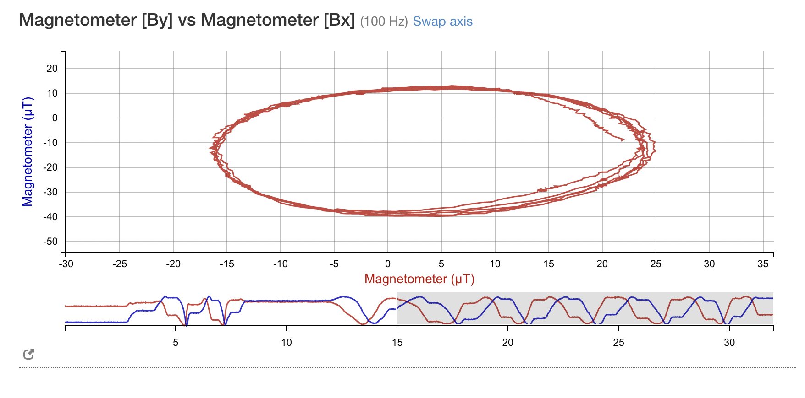
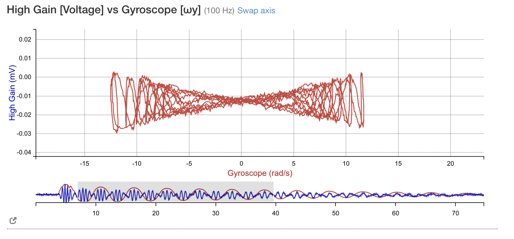

# Lab 10: RLC Circuits

## Experiment 1a: Measuring RC Time Constant
* Interesting to note that when the connections were flipped then the oscilloscope didn't measure anything. Not entrely sure why. 
* Other than that, connections went well and we got to measuring. Apparently there's a way to export the oscilloscope data to .csv directly, and in the interest of more accurate data measurements we think we'll do that instead. 
* A bit too much data and we found that Tektronix doesn't have a very consistent .csv file format so we decided to take the data manually instead.
  * We still have the .csv files so there is still the option to go back 

* Current seemed to roll over really slowly but after waiting a couple of seconds we can see it:

Image of the setup below:

## Table of Data 

Referencepoint is set at: 4.96V at -2.68 seconds. Relative voltage of 0V and 0 seconds.

The data is as follows:

| Channel| Max (V)| Min (V) | 
|-| -| -|
Channel 1 | 5| -5
Channel 2| 4.96| -4.96

**Minimum Voltage: -4.88 V**

**NOTE:** We were measuring a discharge.

| Absolute Voltage (V) | Voltage Difference (V) | Time Difference (seconds) |
| ----------- | ----------- | --------- |
|  4.96|    0| 0 |
| 0.64| 4.32 | 0.3 |
| -1.28 | 6.24| 0.6 |
|-2.64| 7.60| 0.9 |
-3.36 | 8.32 | 1.2
-4.00 | 8.96 | 1.6
-4.24 | 9.20 | 1.8
-4.48 | 9.44 | 2.1
-4.56 | 9.52 | 2.4
-4.72 | 9.68 | 2.7
-4.88 | 9.84 | 4.9

## Experiment 1c: Handcrafting a Capacitor

* Capacitor was created using two sheets of aluminum foil and paper. The areas of the foils had to be different in order to prevent shorting the capacitor. We decided that when we calculate capcatance $\frac{\varepsilon_0A}{d}$, we will use the smaller of the two foils to do so.

* There was a lot of noise in our capacitance measurement, but upon adjusting the frequency and amplitude values we were able to get a signal that wasn't just noise.
  * This was done with the 10M$\Omega$ resistor.

We found that we got a good curve when the resistor attached was $100 k\Omega$, with DC coupling in the oscilloscope.

| Absolute Voltage (V) | Voltage Difference (V) | Time Difference (seconds) |
| ----------- | ----------- | --------- |
| 2.12| 0 | 0|
|-0.04| 2.16 | 0.52|
|-0.76| 2.88 | 1.0|
|-1.24|3.36|1.5
|-1.48| 3.6| 2.0|
|-1.56|3.68|2.5|
|-1.72|3.84|3.0|
|-1.80|3.92|3.5|
|-1.88|4.0|4.0|
|-1.9| 4.02 | 4.5|
|-1.94| 4.06| 5.0|

* Source voltage was 10 Volts $V_{pp}$, whereas the net voltage drop for the capacitor was 5 volts. <!-- try to verify whether this value is right--> The frequency was $100 \ \text{mHz}$.

**Resistance of inductor:** 70.8 $\Omega$.

## Experiment 2b: RLC Overdampted Transient Response

| Absolute Voltage (V) | Voltage Difference (V) | Time Difference (seconds) |
| ----------- | ----------- | --------- |
5.68 | 0 | 0
1.2 | 4.48 | 1
0.32| 5.36| 2.0
0.16| 5.52|3
0.08 | 5.6 | 4|
0.08 |5.6 | 5

When we fit this we an find the $V_{pp}$ via a curve fit and finding where it asymptotes

# Lab 11: Standing Waves

## Experiment 1: $T$, $L$ constant, varying $f$

- Mass attached to the end: 100g + 50g = 150g
- To find a good standing wave we looked for nodes near the vibrator. 

Measured string length: $94.5 \pm 0.2$ cm

|Measured harmonics (Error of $\pm 0.03$ Hz) |
|-----|
9.95
20.00
29.88
40.08
49.94
60.05
70.09

## Experiment 2: $L$, $f$ constant, varying $T$

Measured String Length: $143.5 \pm 0.2$ cm

Estimated $\mu$ calculation using $f = 10$ Hz:

$$ \mu = \frac{T}{4f^2L^2} = \frac{(0.150)(9.8)}{4(10)^2(0.95)^2} = 0.004$$

Estimating required $T$ using $\mu$, using $ T = f^2L^2 \mu$ for $n = 2$:

$$ T = f^2 L^2 \mu = (30)^2(1.435)^2(0.004) = 7.54$$

Dividing this by $g$ we get the theoretical mass $m = 0.769$ kg

frequency: $416 \pm 1 + 50 \pm 1$ g (using the predicted mass)

|Masses measured (g) ($\pm 1$ g)|
|-|
10
35
70
145
240
416

Note that all these masses are measured without considering the 50g mass. So remember to add 50 grams to everything. 

## Experiment 3: $T$, $f$ constant, varying $L$

We chose $150 \pm 1$ grams as our weight, mainly to keep consistent with the first experiment. It's also because we realized that with a smaller mass, the frequency differences between the harmonics will be lower. 

Starting frequency: $30 \pm 0.01$ hz

|Harmonic|Length (cm) ($\pm 0.2$ cm)|
|-|-|
1 | 32.0
2| 62.0
3| 93.3
4| 125.3
5| 155.6
6 |187.4

**Mass of string: 13g for all experiments**, $3.95 \pm 3$ meters. 

# Lab 12: Faraday's Law

Calibration data looks pretty good, the circle is likely squished due to the axes being slightly off. The calibration is shown below. 

## Experiment 1: Generator with Earth's field

parametric plot, using **3 turns**:

All the data was exported to the cloud repository from the IOLab.

## Experiment 2: Verifying Faraday's Law

- 25 turns used in the coil
- inner diameter: 2.80 cm
- outer diameter: 3.65 cm

## Experiment 3: Building a Motor

- 26 turns used in the coil, video taken. 
- Initially had some issues with sanding but it ultimately 

# Capstone Project: Elastic Pendulum
## Plan to gather the data

- From IOLab: can measure $\dot \theta$, $\ddot x$, $\theta$ (video), $T$, $\ddot \theta$ (via a derivative), only need to measure $x$.
  - we can likely measure $x$ using video capturing software, or integrating $\dot \theta$.
- Finding $\theta$ and $x$ via integration methods 

## Plan for analysis

Person 1: Transferring video data by measuring the video (using whatever methods)
- compare these results to the numerical simulation of the experiment (covers the analysis portion)

Person 2: Fits the data with the $\ddot x$ isolated equation, and fit the parameters to get an experimental $k$ and $l_0$. Compare these with $k$ and $l_0$ measured directly from the experiment as well as previous labs.

Person 3: Fits the data with the $\ddot \theta$ isolated equation, and fit the parameters to get an experimental $k$ and $l_0$. Compare these with experimentally measured values of $l_0$. 

## Spring Measurements
- $25.7 \pm 0.5$ cm hanging rest length with IOLab attached. 
  - Length is measured from the center of mass to the rotation point
- $76 \pm 1$ cm is the distance between the phone to the IOLab setup

## Planned measurements

- 15, 10, 20 degrees error 1 degree
- 28, 30, 32 cm for lengths error 0.3 cm

10 degrees, good angle

## New Springs

Before taking any measurementes we needed to figure out the spring constant, which is done via the same procedure as one of our previous labs.

ID for spring constant measurements
- ID: 86d4d (spring 1) NO
- ID: 50a80 (spring 1, undamaged) NO
- 
- ID: 247b4 (spring 2, shorter one) 
- <!-- ID NO LONGER NEEDED, THE DATA WAS UPLOADED ALREADY-->

 Spring 1
- $11.6 \pm 0.2$ cm rest length

Spring 2

- $13.4 \pm 0.2$ cm  hanging rest length

- 15 cm at 10 degrees is the planned angle 
- did 14.4

Spring 3 
- $15.3 \pm 0.2$ cm hanging rest length

1cm extension length for each spring (plus minus the same error)

**IOLAB MASS:** 202.5g

## Analysis Procedure

